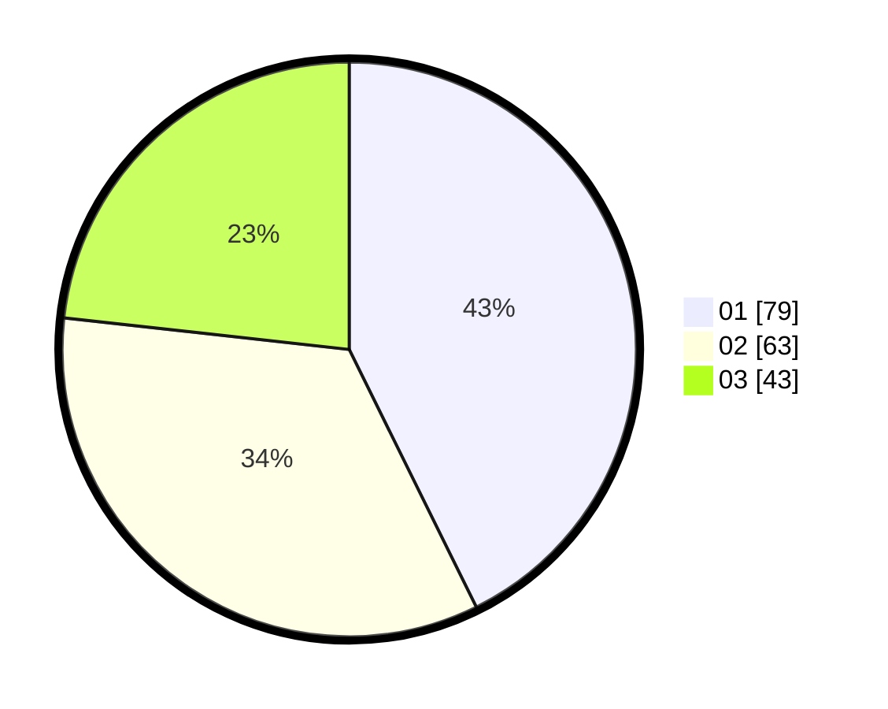

# Hasil

Hasil perolehan suara paslon dapat dilihat pada file paslon-01.txt, paslon-02.txt, dan paslon-03.txt.

Jika tidak ada, artinya data tersebut belum ada pada SIREKAP.

## Perolehan Suara

 * Paslon 01: **79**.
 * Paslon 02: **63**.
 * Paslon 03: **43**.

## Foto C Plano

https://sirekap-obj-formc.kpu.go.id/e0f7/pemilu/ppwp/31/74/03/10/03/3174031003068-20240214-215719--6f1b1f0a-04c7-4d60-9301-882f1409d41e.jpg

https://sirekap-obj-formc.kpu.go.id/e0f7/pemilu/ppwp/31/74/03/10/03/3174031003068-20240214-215744--ffb5aaa5-23f1-48fb-b5e2-05a6fdfb9d72.jpg

https://sirekap-obj-formc.kpu.go.id/e0f7/pemilu/ppwp/31/74/03/10/03/3174031003068-20240214-215804--cfac96ad-3004-44de-ac94-04532e992020.jpg

## DATA PEMILIH TETAP

Jumlah pemilih dalam DPT: **210**.
 * L: **99**.
 * P: **111**.

## DATA PENGGUNA HAK PILIH

Jumlah pengguna hak pilih dalam DPT: **176**.
 * L: **82**.
 * P: **94**.

Jumlah pengguna hak pilih dalam DPTb: **13**.
 * L: **4**.
 * P: **9**.

Jumlah pengguna hak pilih dalam DPK: **1**.
 * L: **0**.
 * P: **1**.

Jumlah pengguna hak pilih: **190**.
 * L: **86**.
 * P: **104**.

## JUMLAH SUARA SAH DAN TIDAK SAH

JUMLAH SELURUH SUARA SAH: **185**.

JUMLAH SUARA TIDAK SAH: **5**.

JUMLAH SELURUH SUARA SAH DAN SUARA TIDAK SAH: **190**.
