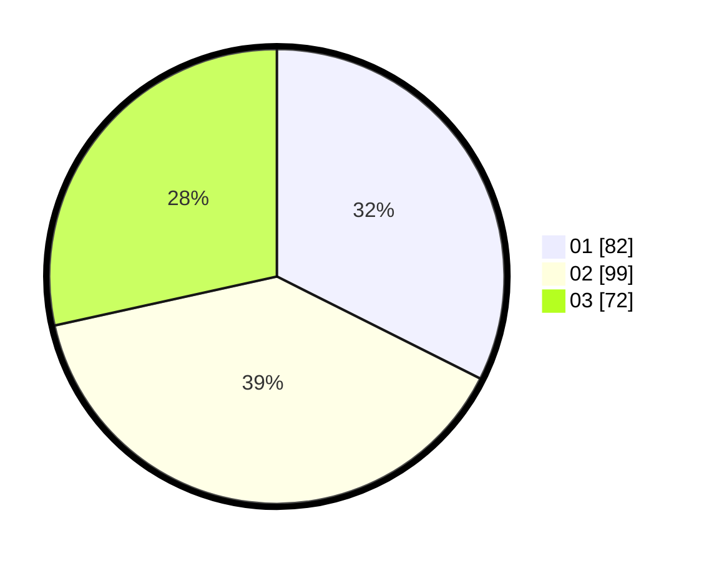

# Hasil

Hasil perolehan suara paslon dapat dilihat pada file paslon-01.txt, paslon-02.txt, dan paslon-03.txt.

Jika tidak ada, artinya data tersebut belum ada pada SIREKAP.

## Perolehan Suara

 * Paslon 01: **82**.
 * Paslon 02: **99**.
 * Paslon 03: **72**.

## Foto C Plano

https://sirekap-obj-formc.kpu.go.id/521d/pemilu/ppwp/31/74/03/10/03/3174031003071-20240214-191255--2f00d452-7e8f-4c56-a353-bdd1b3390fff.jpg

https://sirekap-obj-formc.kpu.go.id/521d/pemilu/ppwp/31/74/03/10/03/3174031003071-20240214-191305--4798f2c0-852d-4f67-8ecc-cc64e0f42b78.jpg

https://sirekap-obj-formc.kpu.go.id/521d/pemilu/ppwp/31/74/03/10/03/3174031003071-20240214-193007--4face2ff-b811-4db5-a018-815a8dade532.jpg

## DATA PEMILIH TETAP

Jumlah pemilih dalam DPT: **288**.
 * L: **126**.
 * P: **162**.

## DATA PENGGUNA HAK PILIH

Jumlah pengguna hak pilih dalam DPT: **244**.
 * L: **107**.
 * P: **137**.

Jumlah pengguna hak pilih dalam DPTb: **10**.
 * L: **1**.
 * P: **9**.

Jumlah pengguna hak pilih dalam DPK: **4**.
 * L: **3**.
 * P: **1**.

Jumlah pengguna hak pilih: **258**.
 * L: **111**.
 * P: **148**.

## JUMLAH SUARA SAH DAN TIDAK SAH

JUMLAH SELURUH SUARA SAH: **253**.

JUMLAH SUARA TIDAK SAH: **6**.

JUMLAH SELURUH SUARA SAH DAN SUARA TIDAK SAH: **259**.
