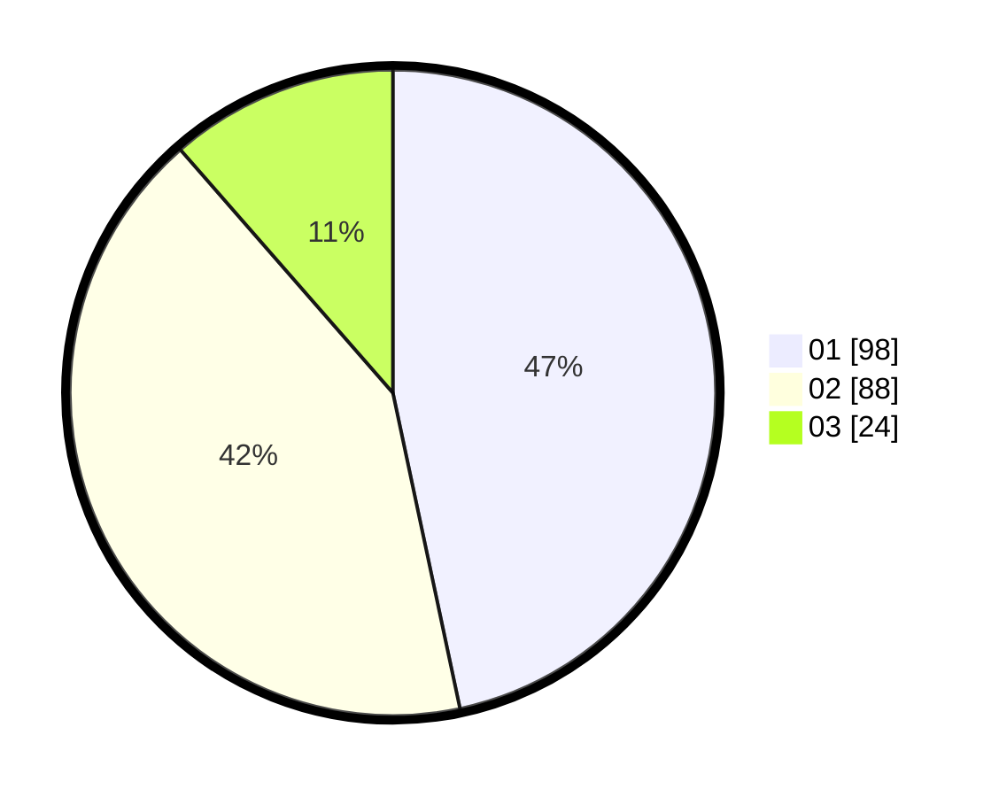

# Hasil

Hasil perolehan suara paslon dapat dilihat pada file paslon-01.txt, paslon-02.txt, dan paslon-03.txt.

Jika tidak ada, artinya data tersebut belum ada pada SIREKAP.

## Perolehan Suara

 * Paslon 01: **98**.
 * Paslon 02: **88**.
 * Paslon 03: **24**.

## Foto C Plano

https://sirekap-obj-formc.kpu.go.id/73ec/pemilu/ppwp/31/74/03/10/03/3174031003073-20240214-184518--23e7a851-5bf9-43a3-8729-de87e00384e5.jpg

https://sirekap-obj-formc.kpu.go.id/73ec/pemilu/ppwp/31/74/03/10/03/3174031003073-20240214-184746--a5ee33c9-5fa1-483a-bdc7-885db39e3258.jpg

https://sirekap-obj-formc.kpu.go.id/73ec/pemilu/ppwp/31/74/03/10/03/3174031003073-20240214-184941--b5cef296-7757-4622-8a42-dcb2804ea9bd.jpg

## DATA PEMILIH TETAP

Jumlah pemilih dalam DPT: **253**.
 * L: **118**.
 * P: **135**.

## DATA PENGGUNA HAK PILIH

Jumlah pengguna hak pilih dalam DPT: **210**.
 * L: **98**.
 * P: **112**.

Jumlah pengguna hak pilih dalam DPTb: **8**.
 * L: **6**.
 * P: **2**.

Jumlah pengguna hak pilih dalam DPK: **1**.
 * L: **1**.
 * P: **0**.

Jumlah pengguna hak pilih: **219**.
 * L: **105**.
 * P: **114**.

## JUMLAH SUARA SAH DAN TIDAK SAH

JUMLAH SELURUH SUARA SAH: **210**.

JUMLAH SUARA TIDAK SAH: **9**.

JUMLAH SELURUH SUARA SAH DAN SUARA TIDAK SAH: **219**.
