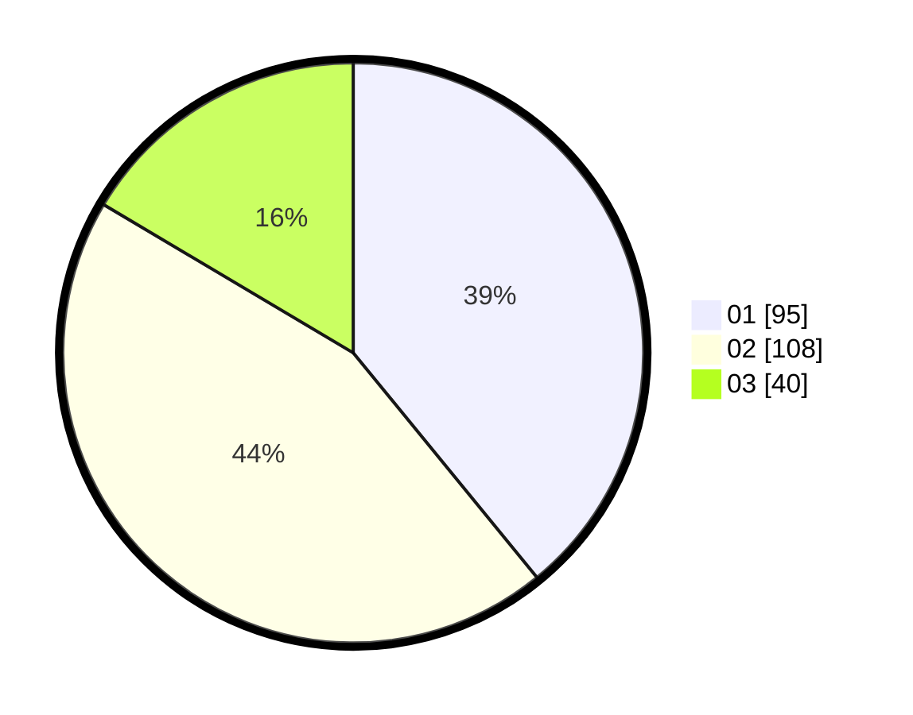

# Hasil

Hasil perolehan suara paslon dapat dilihat pada file paslon-01.txt, paslon-02.txt, dan paslon-03.txt.

Jika tidak ada, artinya data tersebut belum ada pada SIREKAP.

## Perolehan Suara

 * Paslon 01: **95**.
 * Paslon 02: **108**.
 * Paslon 03: **40**.

## Foto C Plano

https://sirekap-obj-formc.kpu.go.id/1860/pemilu/ppwp/31/74/03/10/03/3174031003077-20240216-133049--10d2b428-57ec-4683-b156-b0e567bf83ed.jpg

https://sirekap-obj-formc.kpu.go.id/1860/pemilu/ppwp/31/74/03/10/03/3174031003077-20240216-133051--9db0c0ff-b8da-42d1-980c-2f031628975e.jpg

https://sirekap-obj-formc.kpu.go.id/1860/pemilu/ppwp/31/74/03/10/03/3174031003077-20240216-133050--ab958d4b-7afd-4c85-b039-c71acd3ec4d8.jpg

## DATA PEMILIH TETAP

Jumlah pemilih dalam DPT: **289**.
 * L: **138**.
 * P: **151**.

## DATA PENGGUNA HAK PILIH

Jumlah pengguna hak pilih dalam DPT: **244**.
 * L: **115**.
 * P: **129**.

Jumlah pengguna hak pilih dalam DPTb: **3**.
 * L: **3**.
 * P: **0**.

Jumlah pengguna hak pilih dalam DPK: **0**.
 * L: **0**.
 * P: **0**.

Jumlah pengguna hak pilih: **247**.
 * L: **118**.
 * P: **129**.

## JUMLAH SUARA SAH DAN TIDAK SAH

JUMLAH SELURUH SUARA SAH: **243**.

JUMLAH SUARA TIDAK SAH: **4**.

JUMLAH SELURUH SUARA SAH DAN SUARA TIDAK SAH: **247**.
