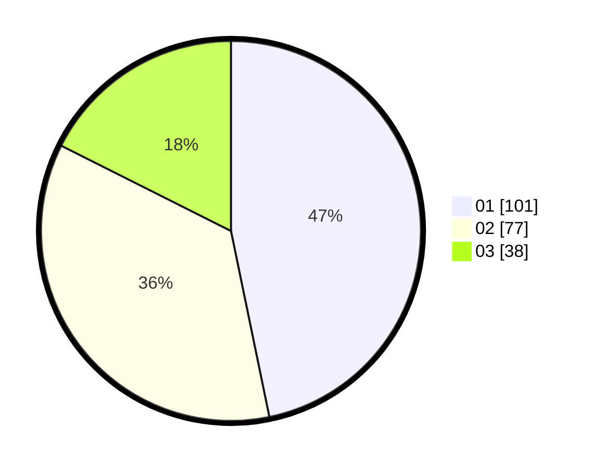

# Hasil

Hasil perolehan suara paslon dapat dilihat pada file paslon-01.txt, paslon-02.txt, dan paslon-03.txt.

Jika tidak ada, artinya data tersebut belum ada pada SIREKAP.

## Perolehan Suara

 * Paslon 01: **101**.
 * Paslon 02: **77**.
 * Paslon 03: **38**.

## Foto C Plano

https://sirekap-obj-formc.kpu.go.id/2d02/pemilu/ppwp/31/74/03/10/03/3174031003081-20240215-063010--377bb70b-4670-4e8b-ac70-ddb1297d947a.jpg

https://sirekap-obj-formc.kpu.go.id/2d02/pemilu/ppwp/31/74/03/10/03/3174031003081-20240215-063513--610c1437-e24f-4832-b7fc-929c472a4ebb.jpg

https://sirekap-obj-formc.kpu.go.id/2d02/pemilu/ppwp/31/74/03/10/03/3174031003081-20240215-063557--a4707057-6cda-4e21-bef4-4c19c56fc685.jpg

## DATA PEMILIH TETAP

Jumlah pemilih dalam DPT: **250**.
 * L: **123**.
 * P: **127**.

## DATA PENGGUNA HAK PILIH

Jumlah pengguna hak pilih dalam DPT: **211**.
 * L: **101**.
 * P: **110**.

Jumlah pengguna hak pilih dalam DPTb: **6**.
 * L: **2**.
 * P: **4**.

Jumlah pengguna hak pilih dalam DPK: **2**.
 * L: **2**.
 * P: **0**.

Jumlah pengguna hak pilih: **219**.
 * L: **105**.
 * P: **114**.

## JUMLAH SUARA SAH DAN TIDAK SAH

JUMLAH SELURUH SUARA SAH: **216**.

JUMLAH SUARA TIDAK SAH: **3**.

JUMLAH SELURUH SUARA SAH DAN SUARA TIDAK SAH: **219**.
