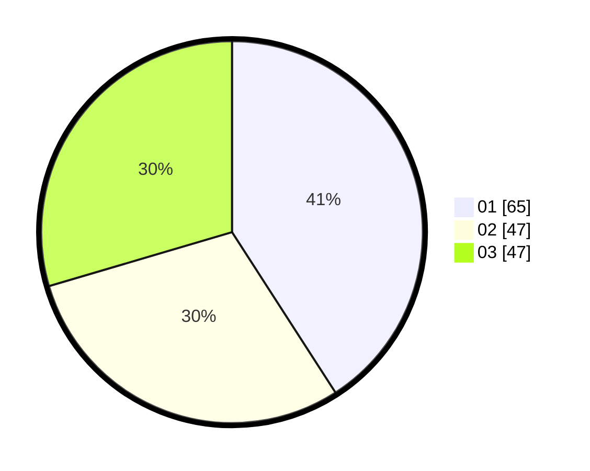

# Hasil

Hasil perolehan suara paslon dapat dilihat pada file paslon-01.txt, paslon-02.txt, dan paslon-03.txt.

Jika tidak ada, artinya data tersebut belum ada pada SIREKAP.

## Perolehan Suara

 * Paslon 01: **65**.
 * Paslon 02: **47**.
 * Paslon 03: **47**.

## Foto C Plano

https://sirekap-obj-formc.kpu.go.id/a96b/pemilu/ppwp/31/74/03/10/03/3174031003088-20240216-145931--0ec9b408-5973-4f0a-9f48-5989ecb8beb7.jpg

https://sirekap-obj-formc.kpu.go.id/a96b/pemilu/ppwp/31/74/03/10/03/3174031003088-20240216-145932--f6c45289-cfe9-42fd-a154-c618ae8df401.jpg

https://sirekap-obj-formc.kpu.go.id/a96b/pemilu/ppwp/31/74/03/10/03/3174031003088-20240216-145931--f610fcbc-231a-4467-9ba2-270b3e183d13.jpg

## DATA PEMILIH TETAP

Jumlah pemilih dalam DPT: **202**.
 * L: **101**.
 * P: **101**.

## DATA PENGGUNA HAK PILIH

Jumlah pengguna hak pilih dalam DPT: **156**.
 * L: **78**.
 * P: **78**.

Jumlah pengguna hak pilih dalam DPTb: **4**.
 * L: **1**.
 * P: **3**.

Jumlah pengguna hak pilih dalam DPK: **0**.
 * L: **0**.
 * P: **0**.

Jumlah pengguna hak pilih: **160**.
 * L: **79**.
 * P: **81**.

## JUMLAH SUARA SAH DAN TIDAK SAH

JUMLAH SELURUH SUARA SAH: **159**.

JUMLAH SUARA TIDAK SAH: **1**.

JUMLAH SELURUH SUARA SAH DAN SUARA TIDAK SAH: **160**.
