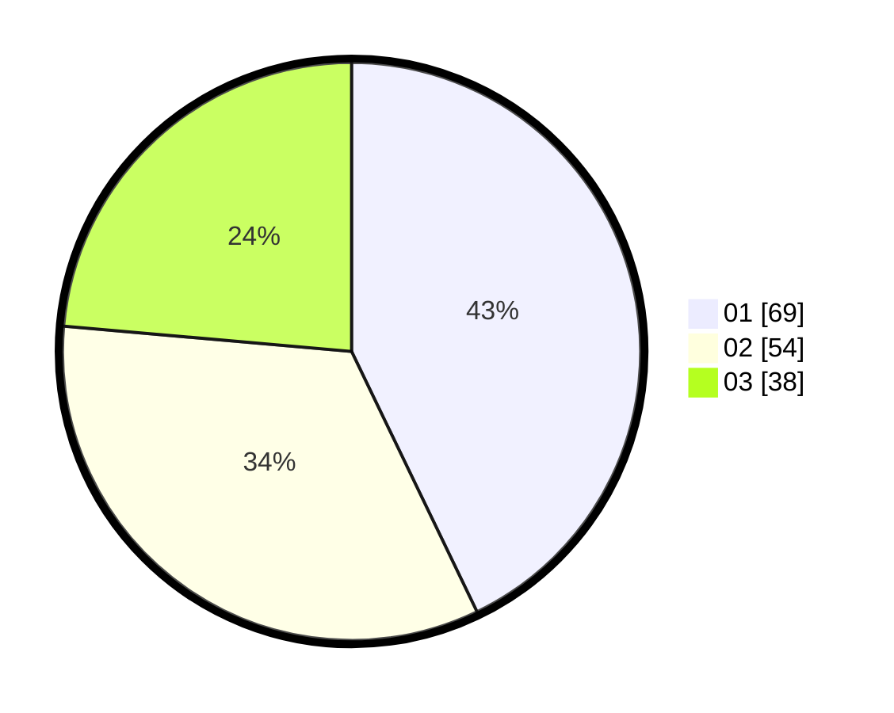

# Hasil

Hasil perolehan suara paslon dapat dilihat pada file paslon-01.txt, paslon-02.txt, dan paslon-03.txt.

Jika tidak ada, artinya data tersebut belum ada pada SIREKAP.

## Perolehan Suara

 * Paslon 01: **69**.
 * Paslon 02: **54**.
 * Paslon 03: **38**.

## Foto C Plano

https://sirekap-obj-formc.kpu.go.id/152a/pemilu/ppwp/31/74/03/10/03/3174031003089-20240214-155444--b32b58d4-5a1e-442b-ade2-098e3f415ef3.jpg

https://sirekap-obj-formc.kpu.go.id/152a/pemilu/ppwp/31/74/03/10/03/3174031003089-20240214-155446--04f8f95f-3529-40bb-a0e1-c657e94655a6.jpg

https://sirekap-obj-formc.kpu.go.id/152a/pemilu/ppwp/31/74/03/10/03/3174031003089-20240214-155449--29c8a264-fe43-4415-91e6-9f189b273e4f.jpg

## DATA PEMILIH TETAP

Jumlah pemilih dalam DPT: **199**.
 * L: **94**.
 * P: **105**.

## DATA PENGGUNA HAK PILIH

Jumlah pengguna hak pilih dalam DPT: **150**.
 * L: **67**.
 * P: **83**.

Jumlah pengguna hak pilih dalam DPTb: **7**.
 * L: **1**.
 * P: **6**.

Jumlah pengguna hak pilih dalam DPK: **4**.
 * L: **2**.
 * P: **2**.

Jumlah pengguna hak pilih: **161**.
 * L: **70**.
 * P: **91**.

## JUMLAH SUARA SAH DAN TIDAK SAH

JUMLAH SELURUH SUARA SAH: **161**.

JUMLAH SUARA TIDAK SAH: **0**.

JUMLAH SELURUH SUARA SAH DAN SUARA TIDAK SAH: **161**.
