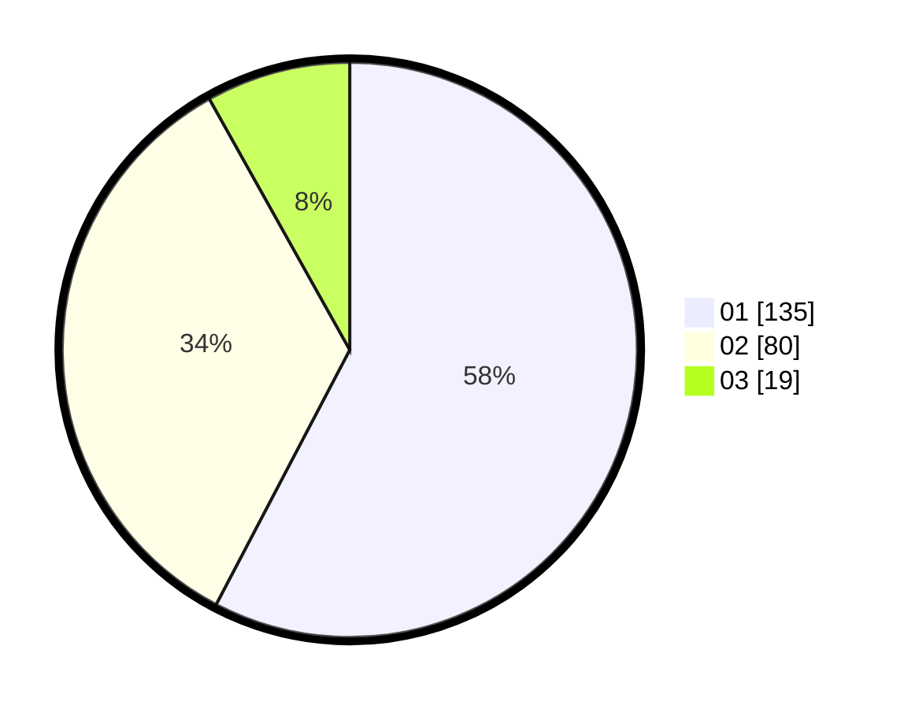

# Hasil

Hasil perolehan suara paslon dapat dilihat pada file paslon-01.txt, paslon-02.txt, dan paslon-03.txt.

Jika tidak ada, artinya data tersebut belum ada pada SIREKAP.

## Perolehan Suara

 * Paslon 01: **135**.
 * Paslon 02: **80**.
 * Paslon 03: **19**.

## Foto C Plano

https://sirekap-obj-formc.kpu.go.id/14cd/pemilu/ppwp/31/74/03/10/03/3174031003104-20240214-155600--64147f72-cd97-4f3f-bc9c-97de6f1ba942.jpg

https://sirekap-obj-formc.kpu.go.id/14cd/pemilu/ppwp/31/74/03/10/03/3174031003104-20240214-155806--7f466142-6a1a-4534-a8d0-d2ff7ee40008.jpg

https://sirekap-obj-formc.kpu.go.id/14cd/pemilu/ppwp/31/74/03/10/03/3174031003104-20240214-155915--0bc5325c-7b34-4e23-a2bb-bef11b6a1c22.jpg

## DATA PEMILIH TETAP

Jumlah pemilih dalam DPT: **286**.
 * L: **156**.
 * P: **130**.

## DATA PENGGUNA HAK PILIH

Jumlah pengguna hak pilih dalam DPT: **233**.
 * L: **120**.
 * P: **113**.

Jumlah pengguna hak pilih dalam DPTb: **3**.
 * L: **3**.
 * P: **0**.

Jumlah pengguna hak pilih dalam DPK: **2**.
 * L: **1**.
 * P: **1**.

Jumlah pengguna hak pilih: **238**.
 * L: **124**.
 * P: **114**.

## JUMLAH SUARA SAH DAN TIDAK SAH

JUMLAH SELURUH SUARA SAH: **234**.

JUMLAH SUARA TIDAK SAH: **4**.

JUMLAH SELURUH SUARA SAH DAN SUARA TIDAK SAH: **238**.
