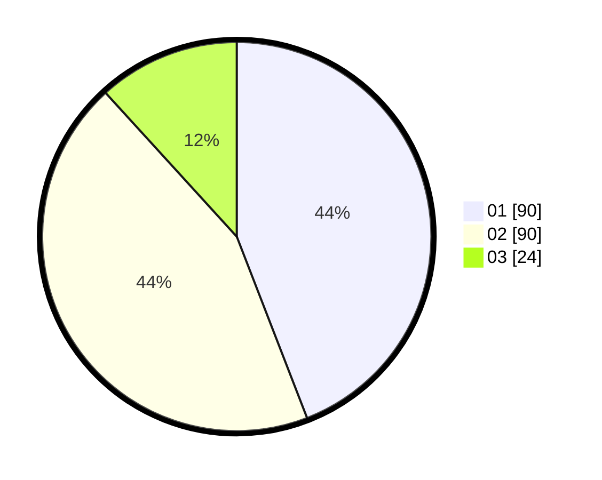

# Hasil

Hasil perolehan suara paslon dapat dilihat pada file paslon-01.txt, paslon-02.txt, dan paslon-03.txt.

Jika tidak ada, artinya data tersebut belum ada pada SIREKAP.

## Perolehan Suara

 * Paslon 01: **90**.
 * Paslon 02: **90**.
 * Paslon 03: **24**.

## Foto C Plano

https://sirekap-obj-formc.kpu.go.id/c816/pemilu/ppwp/31/74/03/10/03/3174031003116-20240214-192054--18035016-a01f-4ca7-a00c-fdcecdc3bf63.jpg

https://sirekap-obj-formc.kpu.go.id/c816/pemilu/ppwp/31/74/03/10/03/3174031003116-20240214-192449--a6b2fca2-544a-43a6-adc5-7885e4e724a6.jpg

https://sirekap-obj-formc.kpu.go.id/c816/pemilu/ppwp/31/74/03/10/03/3174031003116-20240214-192533--b1b566f3-b790-4791-a5aa-d65f981131b0.jpg

## DATA PEMILIH TETAP

Jumlah pemilih dalam DPT: **265**.
 * L: **134**.
 * P: **131**.

## DATA PENGGUNA HAK PILIH

Jumlah pengguna hak pilih dalam DPT: **209**.
 * L: **103**.
 * P: **106**.

Jumlah pengguna hak pilih dalam DPTb: **0**.
 * L: **0**.
 * P: **0**.

Jumlah pengguna hak pilih dalam DPK: **0**.
 * L: **0**.
 * P: **0**.

Jumlah pengguna hak pilih: **209**.
 * L: **103**.
 * P: **106**.

## JUMLAH SUARA SAH DAN TIDAK SAH

JUMLAH SELURUH SUARA SAH: **204**.

JUMLAH SUARA TIDAK SAH: **5**.

JUMLAH SELURUH SUARA SAH DAN SUARA TIDAK SAH: **209**.
