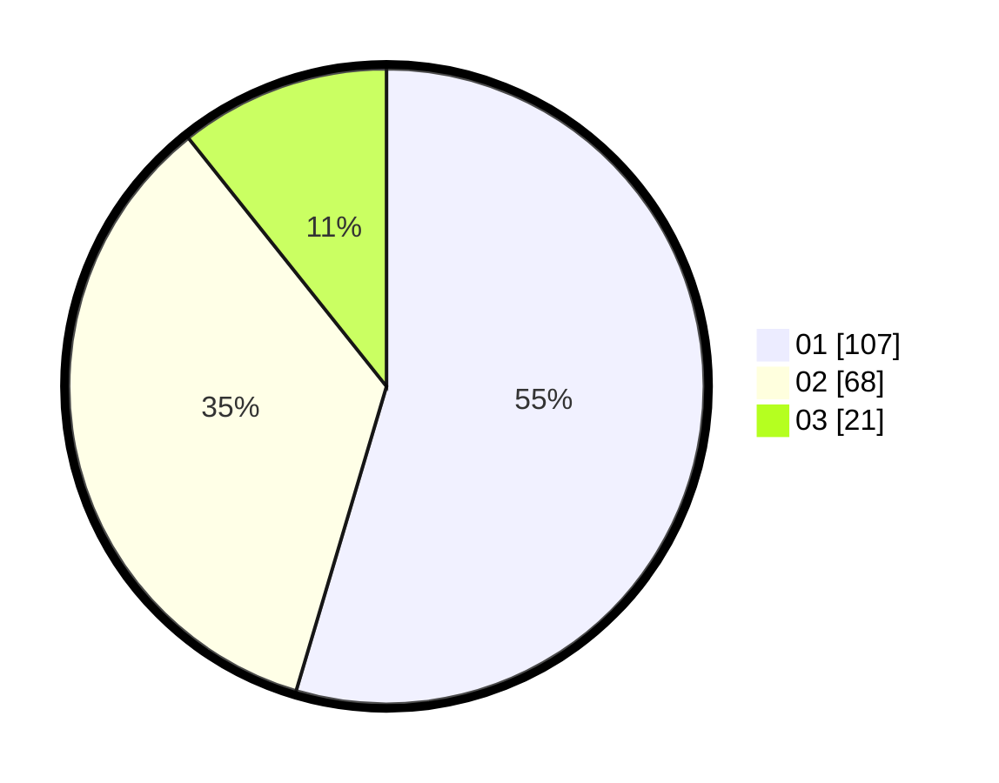

# Hasil

Hasil perolehan suara paslon dapat dilihat pada file paslon-01.txt, paslon-02.txt, dan paslon-03.txt.

Jika tidak ada, artinya data tersebut belum ada pada SIREKAP.

## Perolehan Suara

 * Paslon 01: **107**.
 * Paslon 02: **68**.
 * Paslon 03: **21**.

## Foto C Plano

https://sirekap-obj-formc.kpu.go.id/d2f3/pemilu/ppwp/31/74/03/10/03/3174031003123-20240214-195322--d29e804c-28a9-4da1-97c3-c054f843f29a.jpg

https://sirekap-obj-formc.kpu.go.id/d2f3/pemilu/ppwp/31/74/03/10/03/3174031003123-20240214-195331--aa62bb9b-e3b4-4179-bfc2-e79843425f3f.jpg

https://sirekap-obj-formc.kpu.go.id/d2f3/pemilu/ppwp/31/74/03/10/03/3174031003123-20240215-002314--475ecff8-11f4-4589-8a2b-201445919a8b.jpg
