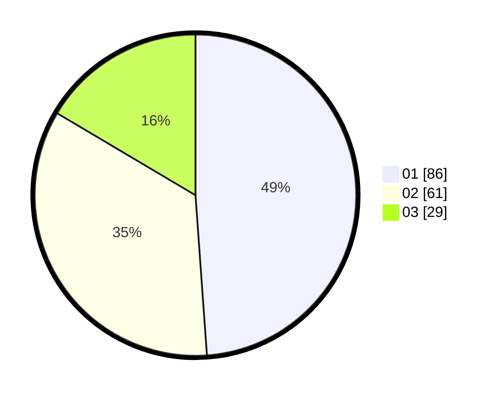

# Hasil

Hasil perolehan suara paslon dapat dilihat pada file paslon-01.txt, paslon-02.txt, dan paslon-03.txt.

Jika tidak ada, artinya data tersebut belum ada pada SIREKAP.

## Perolehan Suara

 * Paslon 01: **86**.
 * Paslon 02: **61**.
 * Paslon 03: **29**.

## Foto C Plano

https://sirekap-obj-formc.kpu.go.id/3eea/pemilu/ppwp/31/74/03/10/03/3174031003126-20240215-221019--5421095d-c5ea-467b-9aef-7bdb3f62ce66.jpg

https://sirekap-obj-formc.kpu.go.id/3eea/pemilu/ppwp/31/74/03/10/03/3174031003126-20240215-221023--256d1936-73a4-4e65-83f0-4f75e5e048b4.jpg

https://sirekap-obj-formc.kpu.go.id/3eea/pemilu/ppwp/31/74/03/10/03/3174031003126-20240215-221021--ebf39946-09ba-4b25-9787-90ba30cb434e.jpg

## DATA PEMILIH TETAP

Jumlah pemilih dalam DPT: **229**.
 * L: **114**.
 * P: **115**.

## DATA PENGGUNA HAK PILIH

Jumlah pengguna hak pilih dalam DPT: **177**.
 * L: **87**.
 * P: **90**.

Jumlah pengguna hak pilih dalam DPTb: **0**.
 * L: **0**.
 * P: **0**.

Jumlah pengguna hak pilih dalam DPK: **0**.
 * L: **0**.
 * P: **0**.

Jumlah pengguna hak pilih: **177**.
 * L: **87**.
 * P: **90**.

## JUMLAH SUARA SAH DAN TIDAK SAH

JUMLAH SELURUH SUARA SAH: **176**.

JUMLAH SUARA TIDAK SAH: **1**.

JUMLAH SELURUH SUARA SAH DAN SUARA TIDAK SAH: **177**.
