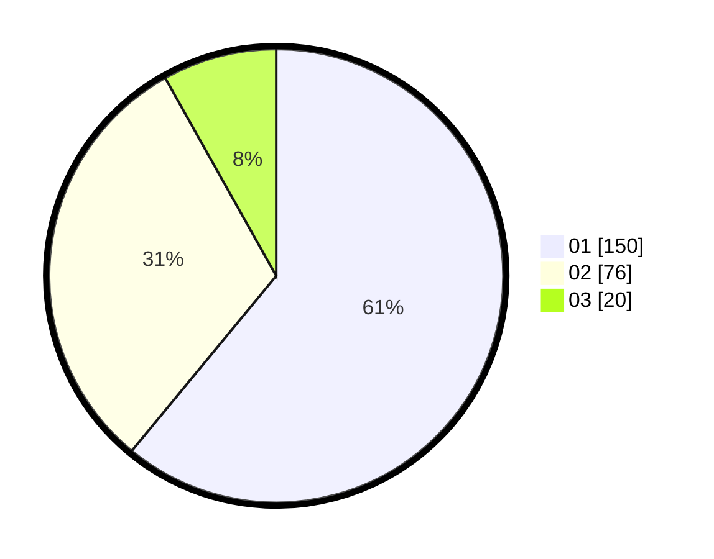

# Hasil

Hasil perolehan suara paslon dapat dilihat pada file paslon-01.txt, paslon-02.txt, dan paslon-03.txt.

Jika tidak ada, artinya data tersebut belum ada pada SIREKAP.

## Perolehan Suara

 * Paslon 01: **150**.
 * Paslon 02: **76**.
 * Paslon 03: **20**.

## Foto C Plano

https://sirekap-obj-formc.kpu.go.id/95d9/pemilu/ppwp/31/74/03/10/03/3174031003130-20240215-003129--f024c38e-8b8d-4b60-add0-676fab5e1d33.jpg

https://sirekap-obj-formc.kpu.go.id/95d9/pemilu/ppwp/31/74/03/10/03/3174031003130-20240215-003157--90739f29-7d60-45a4-ade7-1a78a6e78683.jpg

https://sirekap-obj-formc.kpu.go.id/95d9/pemilu/ppwp/31/74/03/10/03/3174031003130-20240215-003229--54df8931-e1d8-4eab-8c6f-61591a5911e4.jpg

## DATA PEMILIH TETAP

Jumlah pemilih dalam DPT: **295**.
 * L: **149**.
 * P: **146**.

## DATA PENGGUNA HAK PILIH

Jumlah pengguna hak pilih dalam DPT: **247**.
 * L: **116**.
 * P: **131**.

Jumlah pengguna hak pilih dalam DPTb: **3**.
 * L: **0**.
 * P: **3**.

Jumlah pengguna hak pilih dalam DPK: **0**.
 * L: **0**.
 * P: **0**.

Jumlah pengguna hak pilih: **250**.
 * L: **116**.
 * P: **134**.

## JUMLAH SUARA SAH DAN TIDAK SAH

JUMLAH SELURUH SUARA SAH: **246**.

JUMLAH SUARA TIDAK SAH: **4**.

JUMLAH SELURUH SUARA SAH DAN SUARA TIDAK SAH: **250**.
