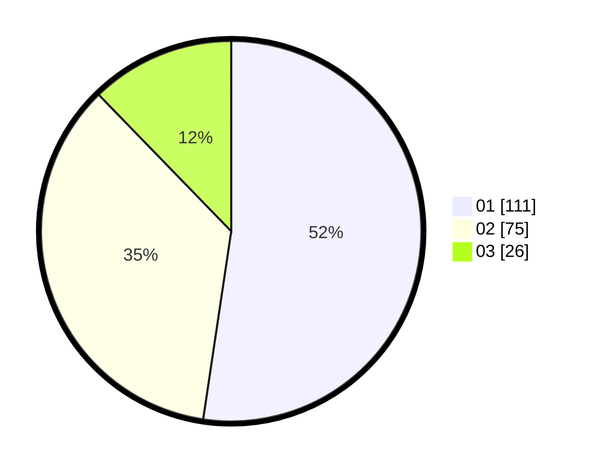

# Hasil

Hasil perolehan suara paslon dapat dilihat pada file paslon-01.txt, paslon-02.txt, dan paslon-03.txt.

Jika tidak ada, artinya data tersebut belum ada pada SIREKAP.

## Perolehan Suara

 * Paslon 01: **111**.
 * Paslon 02: **75**.
 * Paslon 03: **26**.

## Foto C Plano

https://sirekap-obj-formc.kpu.go.id/330e/pemilu/ppwp/31/74/03/10/03/3174031003146-20240214-200722--805868e1-b453-4d19-b364-55da02be959c.jpg

https://sirekap-obj-formc.kpu.go.id/330e/pemilu/ppwp/31/74/03/10/03/3174031003146-20240214-202452--01a7e223-8b01-40af-9022-6903601526b8.jpg

https://sirekap-obj-formc.kpu.go.id/330e/pemilu/ppwp/31/74/03/10/03/3174031003146-20240214-193410--eaea21d7-ad23-452a-a9dd-637b2c62af23.jpg

## DATA PEMILIH TETAP

Jumlah pemilih dalam DPT: **237**.
 * L: **120**.
 * P: **117**.

## DATA PENGGUNA HAK PILIH

Jumlah pengguna hak pilih dalam DPT: **208**.
 * L: **115**.
 * P: **93**.

Jumlah pengguna hak pilih dalam DPTb: **5**.
 * L: **2**.
 * P: **3**.

Jumlah pengguna hak pilih dalam DPK: **2**.
 * L: **2**.
 * P: **0**.

Jumlah pengguna hak pilih: **215**.
 * L: **119**.
 * P: **96**.

## JUMLAH SUARA SAH DAN TIDAK SAH

JUMLAH SELURUH SUARA SAH: **212**.

JUMLAH SUARA TIDAK SAH: **3**.

JUMLAH SELURUH SUARA SAH DAN SUARA TIDAK SAH: **215**.
