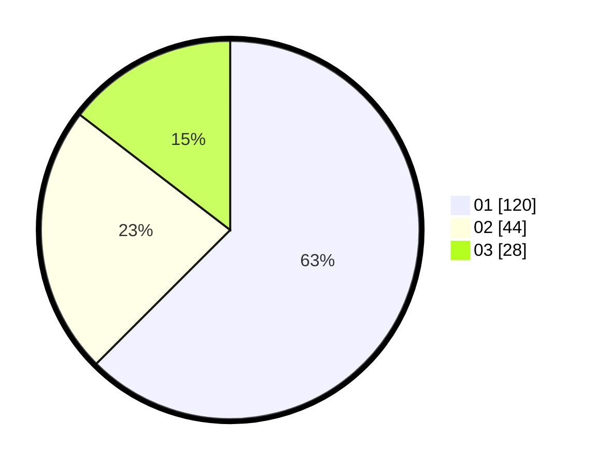

# Hasil

Hasil perolehan suara paslon dapat dilihat pada file paslon-01.txt, paslon-02.txt, dan paslon-03.txt.

Jika tidak ada, artinya data tersebut belum ada pada SIREKAP.

## Perolehan Suara

 * Paslon 01: **120**.
 * Paslon 02: **44**.
 * Paslon 03: **28**.

## Foto C Plano

https://sirekap-obj-formc.kpu.go.id/b3bf/pemilu/ppwp/31/74/03/10/04/3174031004016-20240215-213837--b88363c2-3414-45ce-b319-695c7648e18b.jpg

https://sirekap-obj-formc.kpu.go.id/b3bf/pemilu/ppwp/31/74/03/10/04/3174031004016-20240215-213839--d0a542c7-d63b-4af6-8fba-961d38acfb19.jpg

https://sirekap-obj-formc.kpu.go.id/b3bf/pemilu/ppwp/31/74/03/10/04/3174031004016-20240215-213838--7ca4c22e-bc67-411e-a284-1ae7bb0aa1c1.jpg

## DATA PEMILIH TETAP

Jumlah pemilih dalam DPT: **225**.
 * L: **107**.
 * P: **118**.

## DATA PENGGUNA HAK PILIH

Jumlah pengguna hak pilih dalam DPT: **187**.
 * L: **85**.
 * P: **102**.

Jumlah pengguna hak pilih dalam DPTb: **5**.
 * L: **1**.
 * P: **4**.

Jumlah pengguna hak pilih dalam DPK: **2**.
 * L: **1**.
 * P: **1**.

Jumlah pengguna hak pilih: **194**.
 * L: **87**.
 * P: **107**.

## JUMLAH SUARA SAH DAN TIDAK SAH

JUMLAH SELURUH SUARA SAH: **192**.

JUMLAH SUARA TIDAK SAH: **2**.

JUMLAH SELURUH SUARA SAH DAN SUARA TIDAK SAH: **194**.
