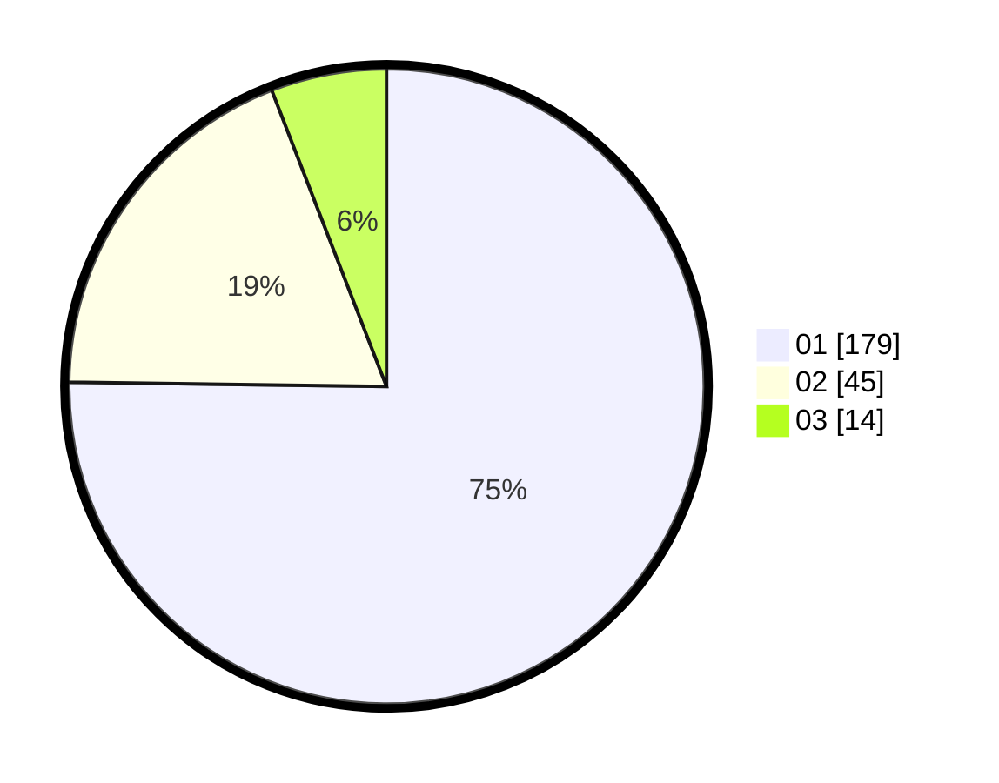

# Hasil

Hasil perolehan suara paslon dapat dilihat pada file paslon-01.txt, paslon-02.txt, dan paslon-03.txt.

Jika tidak ada, artinya data tersebut belum ada pada SIREKAP.

## Perolehan Suara

 * Paslon 01: **179**.
 * Paslon 02: **45**.
 * Paslon 03: **14**.

## Foto C Plano

https://sirekap-obj-formc.kpu.go.id/a118/pemilu/ppwp/31/74/03/10/04/3174031004023-20240216-135729--24500bee-0db5-4756-9790-c1db78ae1d4e.jpg

https://sirekap-obj-formc.kpu.go.id/a118/pemilu/ppwp/31/74/03/10/04/3174031004023-20240216-135730--76de4c81-06de-40c9-ac35-be25449903c3.jpg

https://sirekap-obj-formc.kpu.go.id/a118/pemilu/ppwp/31/74/03/10/04/3174031004023-20240216-135729--b569f965-5b50-4b04-9fcd-69ad95d7aada.jpg

## DATA PEMILIH TETAP

Jumlah pemilih dalam DPT: **289**.
 * L: **143**.
 * P: **146**.

## DATA PENGGUNA HAK PILIH

Jumlah pengguna hak pilih dalam DPT: **236**.
 * L: **110**.
 * P: **126**.

Jumlah pengguna hak pilih dalam DPTb: **4**.
 * L: **1**.
 * P: **3**.

Jumlah pengguna hak pilih dalam DPK: **0**.
 * L: **0**.
 * P: **0**.

Jumlah pengguna hak pilih: **240**.
 * L: **111**.
 * P: **129**.

## JUMLAH SUARA SAH DAN TIDAK SAH

JUMLAH SELURUH SUARA SAH: **238**.

JUMLAH SUARA TIDAK SAH: **2**.

JUMLAH SELURUH SUARA SAH DAN SUARA TIDAK SAH: **240**.
