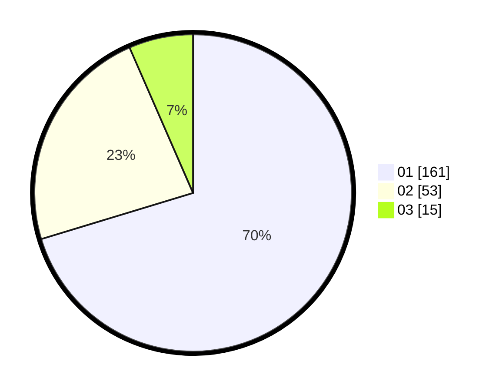

# Hasil

Hasil perolehan suara paslon dapat dilihat pada file paslon-01.txt, paslon-02.txt, dan paslon-03.txt.

Jika tidak ada, artinya data tersebut belum ada pada SIREKAP.

## Perolehan Suara

 * Paslon 01: **161**.
 * Paslon 02: **53**.
 * Paslon 03: **15**.

## Foto C Plano

https://sirekap-obj-formc.kpu.go.id/2986/pemilu/ppwp/31/74/03/10/04/3174031004033-20240216-025544--a4126458-8141-464f-9322-938bc0229fca.jpg

https://sirekap-obj-formc.kpu.go.id/2986/pemilu/ppwp/31/74/03/10/04/3174031004033-20240215-013525--35b0ae8a-879e-4630-958f-cbe5df985d81.jpg

https://sirekap-obj-formc.kpu.go.id/2986/pemilu/ppwp/31/74/03/10/04/3174031004033-20240216-024434--c44f7ea3-c3b5-454e-8145-dfe321952bb7.jpg

## DATA PEMILIH TETAP

Jumlah pemilih dalam DPT: **259**.
 * L: **123**.
 * P: **136**.

## DATA PENGGUNA HAK PILIH

Jumlah pengguna hak pilih dalam DPT: **225**.
 * L: **107**.
 * P: **118**.

Jumlah pengguna hak pilih dalam DPTb: **4**.
 * L: **4**.
 * P: **0**.

Jumlah pengguna hak pilih dalam DPK: **1**.
 * L: **1**.
 * P: **0**.

Jumlah pengguna hak pilih: **230**.
 * L: **112**.
 * P: **118**.

## JUMLAH SUARA SAH DAN TIDAK SAH

JUMLAH SELURUH SUARA SAH: **229**.

JUMLAH SUARA TIDAK SAH: **1**.

JUMLAH SELURUH SUARA SAH DAN SUARA TIDAK SAH: **230**.
