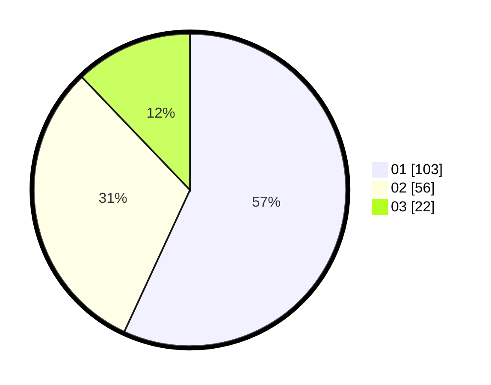

# Hasil

Hasil perolehan suara paslon dapat dilihat pada file paslon-01.txt, paslon-02.txt, dan paslon-03.txt.

Jika tidak ada, artinya data tersebut belum ada pada SIREKAP.

## Perolehan Suara

 * Paslon 01: **103**.
 * Paslon 02: **56**.
 * Paslon 03: **22**.

## Foto C Plano

https://sirekap-obj-formc.kpu.go.id/cf68/pemilu/ppwp/31/74/03/10/04/3174031004034-20240216-035928--fd5e81a6-3bce-47ea-a46e-6fab849a1d6d.jpg

https://sirekap-obj-formc.kpu.go.id/cf68/pemilu/ppwp/31/74/03/10/04/3174031004034-20240216-035931--13150bd9-4fb4-4be2-b265-54468ac9f3ec.jpg

https://sirekap-obj-formc.kpu.go.id/cf68/pemilu/ppwp/31/74/03/10/04/3174031004034-20240214-210620--7c1d3448-7448-4f5b-842c-2b51fbb98662.jpg

## DATA PEMILIH TETAP

Jumlah pemilih dalam DPT: **239**.
 * L: **123**.
 * P: **116**.

## DATA PENGGUNA HAK PILIH

Jumlah pengguna hak pilih dalam DPT: **175**.
 * L: **83**.
 * P: **92**.

Jumlah pengguna hak pilih dalam DPTb: **2**.
 * L: **1**.
 * P: **1**.

Jumlah pengguna hak pilih dalam DPK: **4**.
 * L: **4**.
 * P: **0**.

Jumlah pengguna hak pilih: **181**.
 * L: **88**.
 * P: **93**.

## JUMLAH SUARA SAH DAN TIDAK SAH

JUMLAH SELURUH SUARA SAH: **181**.

JUMLAH SUARA TIDAK SAH: **0**.

JUMLAH SELURUH SUARA SAH DAN SUARA TIDAK SAH: **181**.
