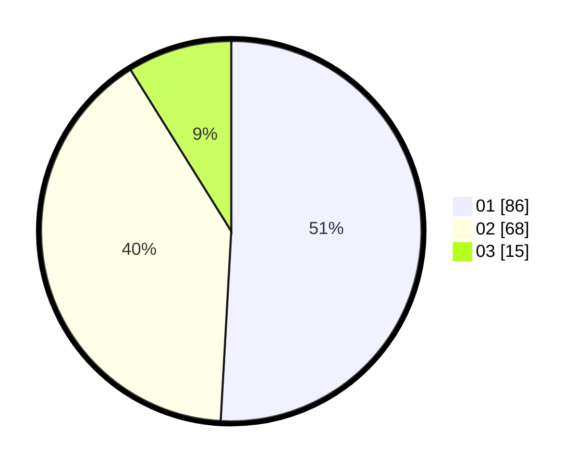

# Hasil

Hasil perolehan suara paslon dapat dilihat pada file paslon-01.txt, paslon-02.txt, dan paslon-03.txt.

Jika tidak ada, artinya data tersebut belum ada pada SIREKAP.

## Perolehan Suara

 * Paslon 01: **86**.
 * Paslon 02: **68**.
 * Paslon 03: **15**.

## Foto C Plano

https://sirekap-obj-formc.kpu.go.id/703c/pemilu/ppwp/31/74/03/10/04/3174031004036-20240216-132341--22eceee2-4bee-4a64-a023-3d2a12c24ddb.jpg

https://sirekap-obj-formc.kpu.go.id/703c/pemilu/ppwp/31/74/03/10/04/3174031004036-20240216-132343--fe906d2e-75cc-4447-b451-bb418dba834b.jpg

https://sirekap-obj-formc.kpu.go.id/703c/pemilu/ppwp/31/74/03/10/04/3174031004036-20240216-132342--1f6be7e7-62b7-48d7-9ddf-1640b8754113.jpg

## DATA PEMILIH TETAP

Jumlah pemilih dalam DPT: **232**.
 * L: **117**.
 * P: **115**.

## DATA PENGGUNA HAK PILIH

Jumlah pengguna hak pilih dalam DPT: **167**.
 * L: **82**.
 * P: **85**.

Jumlah pengguna hak pilih dalam DPTb: **4**.
 * L: **4**.
 * P: **0**.

Jumlah pengguna hak pilih dalam DPK: **2**.
 * L: **1**.
 * P: **1**.

Jumlah pengguna hak pilih: **173**.
 * L: **87**.
 * P: **86**.

## JUMLAH SUARA SAH DAN TIDAK SAH

JUMLAH SELURUH SUARA SAH: **169**.

JUMLAH SUARA TIDAK SAH: **4**.

JUMLAH SELURUH SUARA SAH DAN SUARA TIDAK SAH: **173**.
