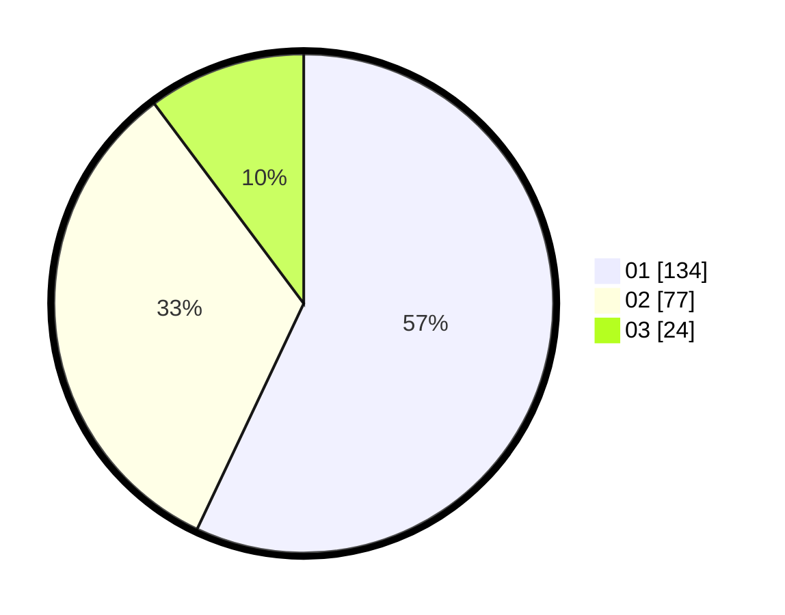

# Hasil

Hasil perolehan suara paslon dapat dilihat pada file paslon-01.txt, paslon-02.txt, dan paslon-03.txt.

Jika tidak ada, artinya data tersebut belum ada pada SIREKAP.

## Perolehan Suara

 * Paslon 01: **134**.
 * Paslon 02: **77**.
 * Paslon 03: **24**.

## Foto C Plano

https://sirekap-obj-formc.kpu.go.id/aa00/pemilu/ppwp/31/74/03/10/04/3174031004038-20240214-211943--04340f11-343e-4db9-912d-4477751bd15b.jpg

https://sirekap-obj-formc.kpu.go.id/aa00/pemilu/ppwp/31/74/03/10/04/3174031004038-20240214-205741--30f1a19b-2af2-493a-8d60-96f28e863b50.jpg

https://sirekap-obj-formc.kpu.go.id/aa00/pemilu/ppwp/31/74/03/10/04/3174031004038-20240214-205908--e8ad99d8-75cf-4788-a917-bbe2cf94120f.jpg

## DATA PEMILIH TETAP

Jumlah pemilih dalam DPT: **292**.
 * L: **148**.
 * P: **144**.

## DATA PENGGUNA HAK PILIH

Jumlah pengguna hak pilih dalam DPT: **234**.
 * L: **119**.
 * P: **115**.

Jumlah pengguna hak pilih dalam DPTb: **3**.
 * L: **1**.
 * P: **2**.

Jumlah pengguna hak pilih dalam DPK: **1**.
 * L: **0**.
 * P: **1**.

Jumlah pengguna hak pilih: **238**.
 * L: **120**.
 * P: **118**.

## JUMLAH SUARA SAH DAN TIDAK SAH

JUMLAH SELURUH SUARA SAH: **235**.

JUMLAH SUARA TIDAK SAH: **3**.

JUMLAH SELURUH SUARA SAH DAN SUARA TIDAK SAH: **238**.
