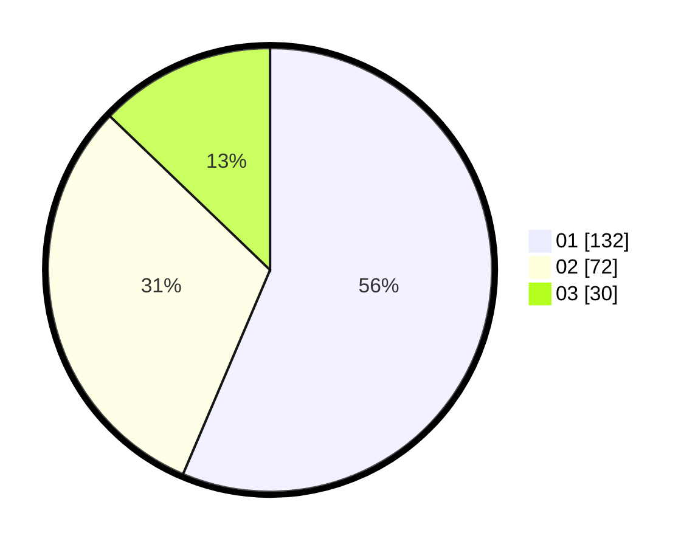

# Hasil

Hasil perolehan suara paslon dapat dilihat pada file paslon-01.txt, paslon-02.txt, dan paslon-03.txt.

Jika tidak ada, artinya data tersebut belum ada pada SIREKAP.

## Perolehan Suara

 * Paslon 01: **132**.
 * Paslon 02: **72**.
 * Paslon 03: **30**.

## Foto C Plano

https://sirekap-obj-formc.kpu.go.id/942f/pemilu/ppwp/31/74/03/10/04/3174031004042-20240216-152006--35bceb51-4525-45be-93a1-296bc7c190ec.jpg

https://sirekap-obj-formc.kpu.go.id/942f/pemilu/ppwp/31/74/03/10/04/3174031004042-20240216-152007--c3c7ef0d-1bb6-4e52-a6d5-71fc258b77cc.jpg

https://sirekap-obj-formc.kpu.go.id/942f/pemilu/ppwp/31/74/03/10/04/3174031004042-20240216-152006--72b20da3-bdbd-41eb-9bb4-5633acd146d2.jpg

## DATA PEMILIH TETAP

Jumlah pemilih dalam DPT: **290**.
 * L: **150**.
 * P: **140**.

## DATA PENGGUNA HAK PILIH

Jumlah pengguna hak pilih dalam DPT: **225**.
 * L: **107**.
 * P: **118**.

Jumlah pengguna hak pilih dalam DPTb: **9**.
 * L: **6**.
 * P: **3**.

Jumlah pengguna hak pilih dalam DPK: **4**.
 * L: **0**.
 * P: **4**.

Jumlah pengguna hak pilih: **238**.
 * L: **113**.
 * P: **125**.

## JUMLAH SUARA SAH DAN TIDAK SAH

JUMLAH SELURUH SUARA SAH: **234**.

JUMLAH SUARA TIDAK SAH: **4**.

JUMLAH SELURUH SUARA SAH DAN SUARA TIDAK SAH: **238**.
