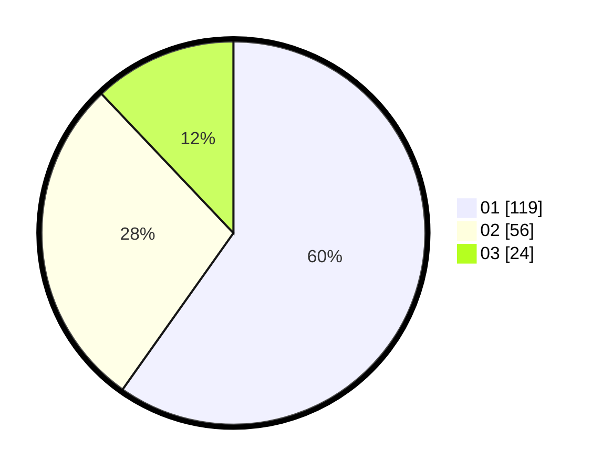

# Hasil

Hasil perolehan suara paslon dapat dilihat pada file paslon-01.txt, paslon-02.txt, dan paslon-03.txt.

Jika tidak ada, artinya data tersebut belum ada pada SIREKAP.

## Perolehan Suara

 * Paslon 01: **119**.
 * Paslon 02: **56**.
 * Paslon 03: **24**.

## Foto C Plano

https://sirekap-obj-formc.kpu.go.id/8fd1/pemilu/ppwp/31/74/03/10/04/3174031004050-20240216-145555--5149322d-8c62-4e44-8be5-9fd5c11ac425.jpg

https://sirekap-obj-formc.kpu.go.id/8fd1/pemilu/ppwp/31/74/03/10/04/3174031004050-20240216-145557--9fa67e59-703d-4530-a8b0-61269def6282.jpg

https://sirekap-obj-formc.kpu.go.id/8fd1/pemilu/ppwp/31/74/03/10/04/3174031004050-20240216-145556--9df1ec43-5781-44c0-9292-15d014f1489b.jpg

## DATA PEMILIH TETAP

Jumlah pemilih dalam DPT: **248**.
 * L: **131**.
 * P: **117**.

## DATA PENGGUNA HAK PILIH

Jumlah pengguna hak pilih dalam DPT: **196**.
 * L: **98**.
 * P: **98**.

Jumlah pengguna hak pilih dalam DPTb: **6**.
 * L: **2**.
 * P: **4**.

Jumlah pengguna hak pilih dalam DPK: **1**.
 * L: **1**.
 * P: **0**.

Jumlah pengguna hak pilih: **203**.
 * L: **101**.
 * P: **102**.

## JUMLAH SUARA SAH DAN TIDAK SAH

JUMLAH SELURUH SUARA SAH: **199**.

JUMLAH SUARA TIDAK SAH: **4**.

JUMLAH SELURUH SUARA SAH DAN SUARA TIDAK SAH: **203**.
