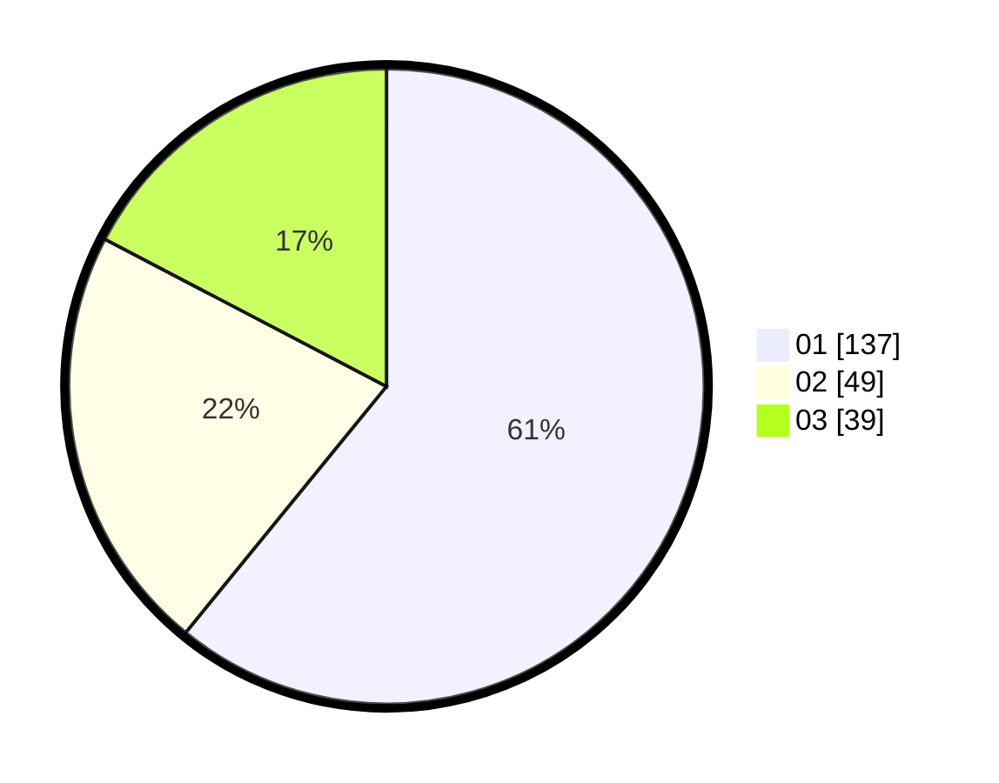

# Hasil

Hasil perolehan suara paslon dapat dilihat pada file paslon-01.txt, paslon-02.txt, dan paslon-03.txt.

Jika tidak ada, artinya data tersebut belum ada pada SIREKAP.

## Perolehan Suara

 * Paslon 01: **137**.
 * Paslon 02: **49**.
 * Paslon 03: **39**.

## Foto C Plano

https://sirekap-obj-formc.kpu.go.id/517f/pemilu/ppwp/31/74/03/10/04/3174031004053-20240215-205517--9c776cea-dd0f-4084-95fb-fefc75c6b4b6.jpg

https://sirekap-obj-formc.kpu.go.id/517f/pemilu/ppwp/31/74/03/10/04/3174031004053-20240215-205518--8d448e72-6339-4608-bf0e-4aa8b4320171.jpg

https://sirekap-obj-formc.kpu.go.id/517f/pemilu/ppwp/31/74/03/10/04/3174031004053-20240215-205518--ba679480-6633-4329-a5fd-804d200c4fb0.jpg

## DATA PEMILIH TETAP

Jumlah pemilih dalam DPT: **285**.
 * L: **141**.
 * P: **144**.

## DATA PENGGUNA HAK PILIH

Jumlah pengguna hak pilih dalam DPT: **223**.
 * L: **109**.
 * P: **114**.

Jumlah pengguna hak pilih dalam DPTb: **2**.
 * L: **2**.
 * P: **0**.

Jumlah pengguna hak pilih dalam DPK: **3**.
 * L: **0**.
 * P: **3**.

Jumlah pengguna hak pilih: **228**.
 * L: **111**.
 * P: **117**.

## JUMLAH SUARA SAH DAN TIDAK SAH

JUMLAH SELURUH SUARA SAH: **225**.

JUMLAH SUARA TIDAK SAH: **3**.

JUMLAH SELURUH SUARA SAH DAN SUARA TIDAK SAH: **228**.
