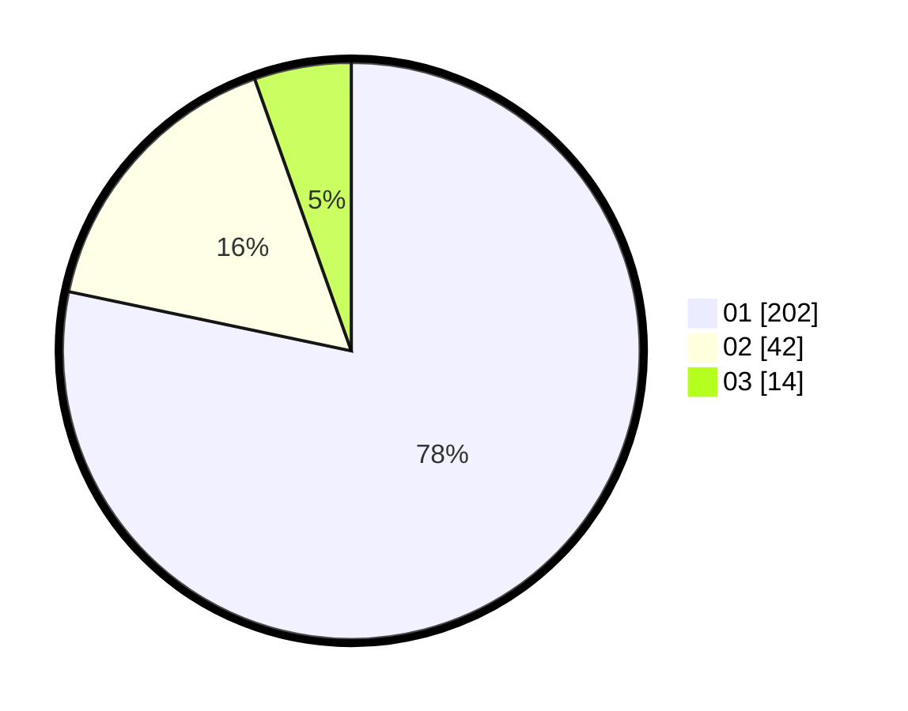

# Hasil

Hasil perolehan suara paslon dapat dilihat pada file paslon-01.txt, paslon-02.txt, dan paslon-03.txt.

Jika tidak ada, artinya data tersebut belum ada pada SIREKAP.

## Perolehan Suara

 * Paslon 01: **202**.
 * Paslon 02: **42**.
 * Paslon 03: **14**.

## Foto C Plano

https://sirekap-obj-formc.kpu.go.id/7b25/pemilu/ppwp/31/74/03/10/04/3174031004057-20240216-155620--1bca7ef3-9d76-4ffe-9a21-0fd06be178a2.jpg

https://sirekap-obj-formc.kpu.go.id/7b25/pemilu/ppwp/31/74/03/10/04/3174031004057-20240216-155621--8fee1bc7-609c-416a-ab11-c7f2eee03fc0.jpg

https://sirekap-obj-formc.kpu.go.id/7b25/pemilu/ppwp/31/74/03/10/04/3174031004057-20240216-155620--3680f570-ba8a-4102-b142-55f43ea996c5.jpg

## DATA PEMILIH TETAP

Jumlah pemilih dalam DPT: **293**.
 * L: **153**.
 * P: **140**.

## DATA PENGGUNA HAK PILIH

Jumlah pengguna hak pilih dalam DPT: **242**.
 * L: **123**.
 * P: **119**.

Jumlah pengguna hak pilih dalam DPTb: **12**.
 * L: **6**.
 * P: **6**.

Jumlah pengguna hak pilih dalam DPK: **5**.
 * L: **2**.
 * P: **3**.

Jumlah pengguna hak pilih: **259**.
 * L: **131**.
 * P: **128**.

## JUMLAH SUARA SAH DAN TIDAK SAH

JUMLAH SELURUH SUARA SAH: **258**.

JUMLAH SUARA TIDAK SAH: **1**.

JUMLAH SELURUH SUARA SAH DAN SUARA TIDAK SAH: **259**.
