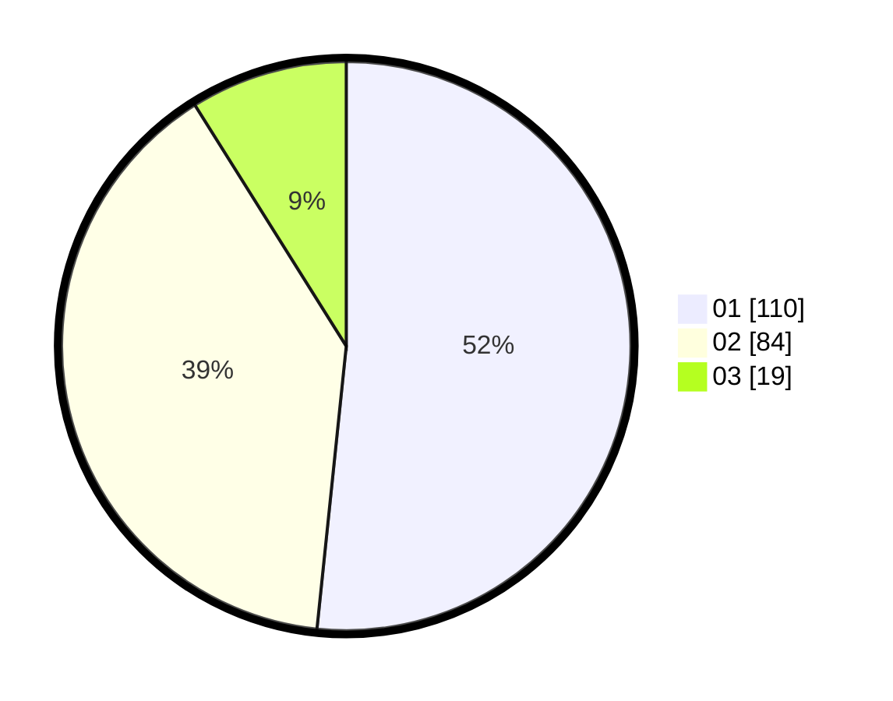

# Hasil

Hasil perolehan suara paslon dapat dilihat pada file paslon-01.txt, paslon-02.txt, dan paslon-03.txt.

Jika tidak ada, artinya data tersebut belum ada pada SIREKAP.

## Perolehan Suara

 * Paslon 01: **110**.
 * Paslon 02: **84**.
 * Paslon 03: **19**.

## Foto C Plano

https://sirekap-obj-formc.kpu.go.id/3c9c/pemilu/ppwp/31/74/03/10/04/3174031004058-20240214-185228--77f2b0ef-bce3-4b39-ba1f-f711b3866c8e.jpg

https://sirekap-obj-formc.kpu.go.id/3c9c/pemilu/ppwp/31/74/03/10/04/3174031004058-20240215-205203--3829c593-2dc5-4645-962c-9011eafb4737.jpg

https://sirekap-obj-formc.kpu.go.id/3c9c/pemilu/ppwp/31/74/03/10/04/3174031004058-20240214-185446--d33d87f4-ed0b-45fa-8fd9-6d0ef684ea36.jpg

## DATA PEMILIH TETAP

Jumlah pemilih dalam DPT: **280**.
 * L: **142**.
 * P: **138**.

## DATA PENGGUNA HAK PILIH

Jumlah pengguna hak pilih dalam DPT: **211**.
 * L: **100**.
 * P: **111**.

Jumlah pengguna hak pilih dalam DPTb: **4**.
 * L: **3**.
 * P: **1**.

Jumlah pengguna hak pilih dalam DPK: **1**.
 * L: **0**.
 * P: **1**.

Jumlah pengguna hak pilih: **216**.
 * L: **103**.
 * P: **113**.

## JUMLAH SUARA SAH DAN TIDAK SAH

JUMLAH SELURUH SUARA SAH: **213**.

JUMLAH SUARA TIDAK SAH: **3**.

JUMLAH SELURUH SUARA SAH DAN SUARA TIDAK SAH: **216**.
