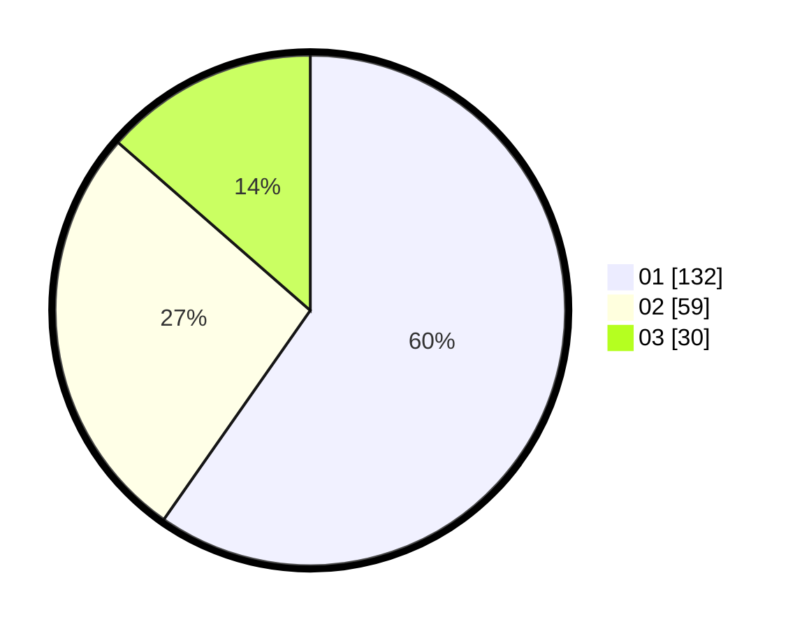

# Hasil

Hasil perolehan suara paslon dapat dilihat pada file paslon-01.txt, paslon-02.txt, dan paslon-03.txt.

Jika tidak ada, artinya data tersebut belum ada pada SIREKAP.

## Perolehan Suara

 * Paslon 01: **132**.
 * Paslon 02: **59**.
 * Paslon 03: **30**.

## Foto C Plano

https://sirekap-obj-formc.kpu.go.id/4fdb/pemilu/ppwp/31/74/03/10/04/3174031004060-20240216-115939--1b4bb057-1615-48ef-bf55-42f12159e001.jpg

https://sirekap-obj-formc.kpu.go.id/4fdb/pemilu/ppwp/31/74/03/10/04/3174031004060-20240216-115945--eb65c2cf-2265-4724-85c9-47bc36c9f7c9.jpg

https://sirekap-obj-formc.kpu.go.id/4fdb/pemilu/ppwp/31/74/03/10/04/3174031004060-20240216-115942--19533aba-cc08-4d5d-b689-022a50b0d5d9.jpg

## DATA PEMILIH TETAP

Jumlah pemilih dalam DPT: **0**.
 * L: **0**.
 * P: **0**.

## DATA PENGGUNA HAK PILIH

Jumlah pengguna hak pilih dalam DPT: **0**.
 * L: **0**.
 * P: **0**.

Jumlah pengguna hak pilih dalam DPTb: **0**.
 * L: **0**.
 * P: **0**.

Jumlah pengguna hak pilih dalam DPK: **0**.
 * L: **0**.
 * P: **0**.

Jumlah pengguna hak pilih: **0**.
 * L: **0**.
 * P: **0**.

## JUMLAH SUARA SAH DAN TIDAK SAH

JUMLAH SELURUH SUARA SAH: **221**.

JUMLAH SUARA TIDAK SAH: **6**.

JUMLAH SELURUH SUARA SAH DAN SUARA TIDAK SAH: **227**.
