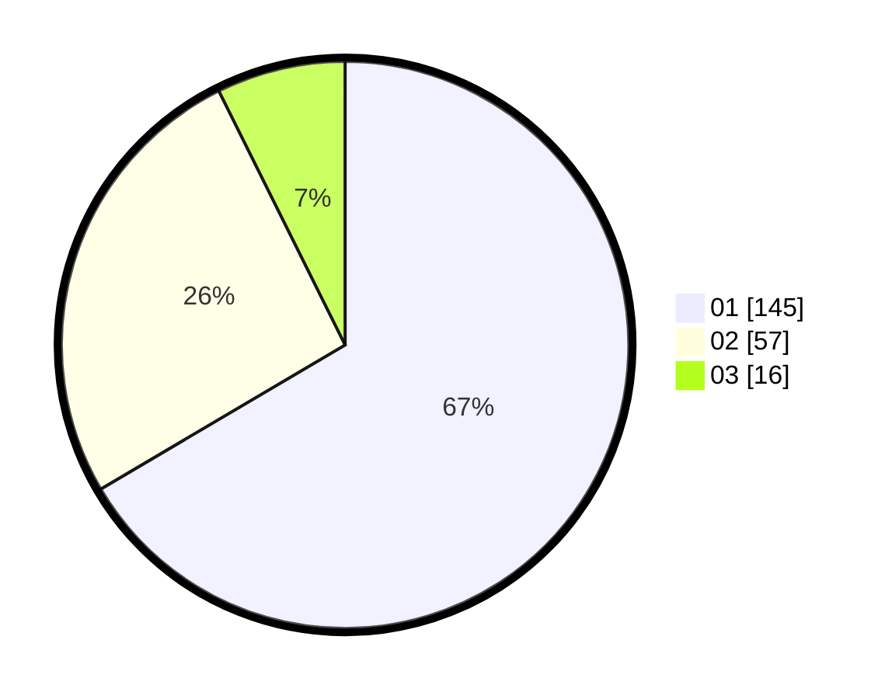

# Hasil

Hasil perolehan suara paslon dapat dilihat pada file paslon-01.txt, paslon-02.txt, dan paslon-03.txt.

Jika tidak ada, artinya data tersebut belum ada pada SIREKAP.

## Perolehan Suara

 * Paslon 01: **145**.
 * Paslon 02: **57**.
 * Paslon 03: **16**.

## Foto C Plano

https://sirekap-obj-formc.kpu.go.id/479e/pemilu/ppwp/31/74/03/10/04/3174031004063-20240215-224941--265bb357-8897-4219-9af0-3c705b4000e5.jpg

https://sirekap-obj-formc.kpu.go.id/479e/pemilu/ppwp/31/74/03/10/04/3174031004063-20240215-224944--8390e07d-2d95-42d8-bcb6-5d10b9101bc1.jpg

https://sirekap-obj-formc.kpu.go.id/479e/pemilu/ppwp/31/74/03/10/04/3174031004063-20240215-224943--72d26140-8d15-4857-ae52-c425ff8fa3e1.jpg

## DATA PEMILIH TETAP

Jumlah pemilih dalam DPT: **287**.
 * L: **155**.
 * P: **132**.

## DATA PENGGUNA HAK PILIH

Jumlah pengguna hak pilih dalam DPT: **215**.
 * L: **109**.
 * P: **106**.

Jumlah pengguna hak pilih dalam DPTb: **3**.
 * L: **0**.
 * P: **3**.

Jumlah pengguna hak pilih dalam DPK: **2**.
 * L: **2**.
 * P: **0**.

Jumlah pengguna hak pilih: **220**.
 * L: **111**.
 * P: **109**.

## JUMLAH SUARA SAH DAN TIDAK SAH

JUMLAH SELURUH SUARA SAH: **218**.

JUMLAH SUARA TIDAK SAH: **2**.

JUMLAH SELURUH SUARA SAH DAN SUARA TIDAK SAH: **220**.
