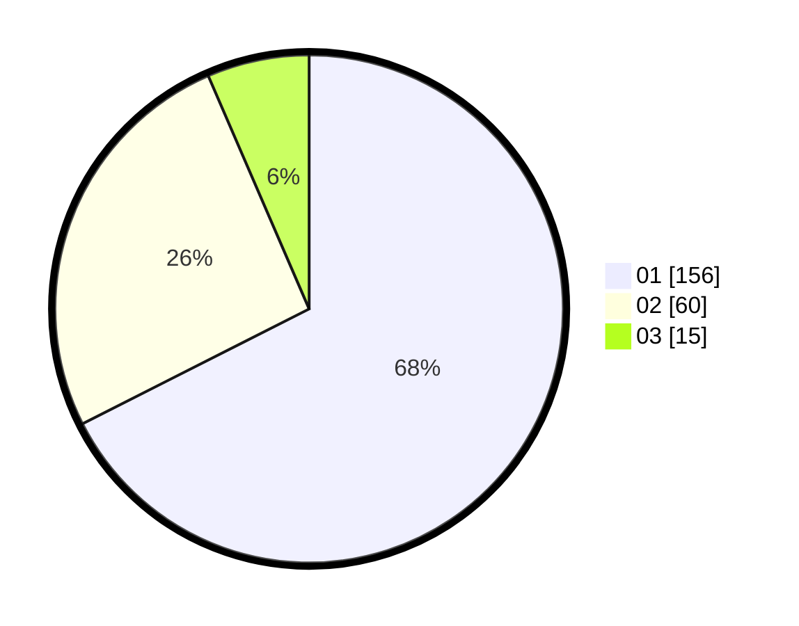

# Hasil

Hasil perolehan suara paslon dapat dilihat pada file paslon-01.txt, paslon-02.txt, dan paslon-03.txt.

Jika tidak ada, artinya data tersebut belum ada pada SIREKAP.

## Perolehan Suara

 * Paslon 01: **156**.
 * Paslon 02: **60**.
 * Paslon 03: **15**.

## Foto C Plano

https://sirekap-obj-formc.kpu.go.id/990e/pemilu/ppwp/31/74/03/10/04/3174031004065-20240216-153430--34ae22cd-866d-49b7-9b95-a517876e8793.jpg

https://sirekap-obj-formc.kpu.go.id/990e/pemilu/ppwp/31/74/03/10/04/3174031004065-20240216-153432--d0093d12-4adc-474e-bff6-b3282935add2.jpg

https://sirekap-obj-formc.kpu.go.id/990e/pemilu/ppwp/31/74/03/10/04/3174031004065-20240216-153431--813c9523-32ae-4c5c-a3f0-19f24e8d5e7c.jpg

## DATA PEMILIH TETAP

Jumlah pemilih dalam DPT: **290**.
 * L: **147**.
 * P: **143**.

## DATA PENGGUNA HAK PILIH

Jumlah pengguna hak pilih dalam DPT: **210**.
 * L: **100**.
 * P: **110**.

Jumlah pengguna hak pilih dalam DPTb: **10**.
 * L: **1**.
 * P: **9**.

Jumlah pengguna hak pilih dalam DPK: **14**.
 * L: **8**.
 * P: **6**.

Jumlah pengguna hak pilih: **234**.
 * L: **109**.
 * P: **125**.

## JUMLAH SUARA SAH DAN TIDAK SAH

JUMLAH SELURUH SUARA SAH: **231**.

JUMLAH SUARA TIDAK SAH: **3**.

JUMLAH SELURUH SUARA SAH DAN SUARA TIDAK SAH: **234**.
