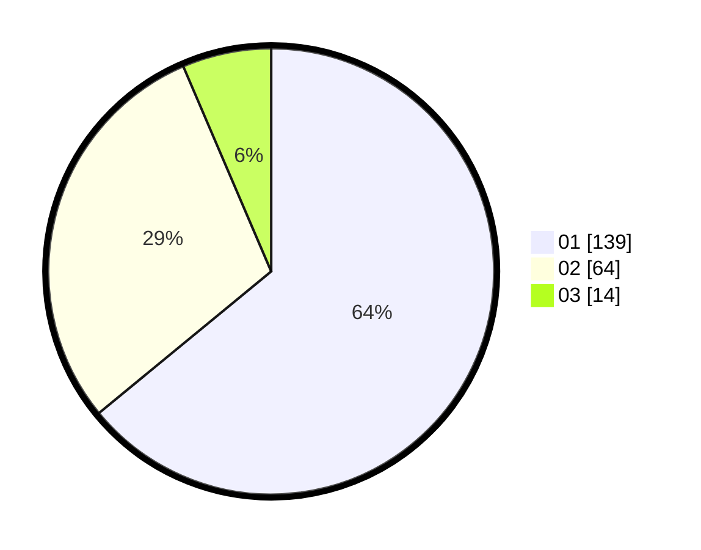

# Hasil

Hasil perolehan suara paslon dapat dilihat pada file paslon-01.txt, paslon-02.txt, dan paslon-03.txt.

Jika tidak ada, artinya data tersebut belum ada pada SIREKAP.

## Perolehan Suara

 * Paslon 01: **139**.
 * Paslon 02: **64**.
 * Paslon 03: **14**.

## Foto C Plano

https://sirekap-obj-formc.kpu.go.id/49cd/pemilu/ppwp/31/74/03/10/04/3174031004073-20240216-002140--8c988e67-70af-439f-9c8b-e16066992d22.jpg

https://sirekap-obj-formc.kpu.go.id/49cd/pemilu/ppwp/31/74/03/10/04/3174031004073-20240216-002142--3404dda9-a831-4992-829e-819d58094a2a.jpg

https://sirekap-obj-formc.kpu.go.id/49cd/pemilu/ppwp/31/74/03/10/04/3174031004073-20240216-002141--e94bd46a-abae-4254-a2d6-0d4e4dd97f88.jpg

## DATA PEMILIH TETAP

Jumlah pemilih dalam DPT: **277**.
 * L: **149**.
 * P: **128**.

## DATA PENGGUNA HAK PILIH

Jumlah pengguna hak pilih dalam DPT: **220**.
 * L: **116**.
 * P: **104**.

Jumlah pengguna hak pilih dalam DPTb: **0**.
 * L: **0**.
 * P: **0**.

Jumlah pengguna hak pilih dalam DPK: **0**.
 * L: **0**.
 * P: **0**.

Jumlah pengguna hak pilih: **220**.
 * L: **116**.
 * P: **104**.

## JUMLAH SUARA SAH DAN TIDAK SAH

JUMLAH SELURUH SUARA SAH: **217**.

JUMLAH SUARA TIDAK SAH: **3**.

JUMLAH SELURUH SUARA SAH DAN SUARA TIDAK SAH: **220**.
