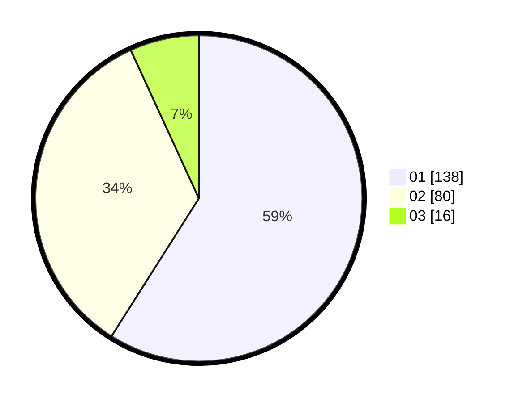

# Hasil

Hasil perolehan suara paslon dapat dilihat pada file paslon-01.txt, paslon-02.txt, dan paslon-03.txt.

Jika tidak ada, artinya data tersebut belum ada pada SIREKAP.

## Perolehan Suara

 * Paslon 01: **138**.
 * Paslon 02: **80**.
 * Paslon 03: **16**.

## Foto C Plano

https://sirekap-obj-formc.kpu.go.id/41d5/pemilu/ppwp/31/74/03/10/04/3174031004074-20240216-051720--68005b68-58bf-434a-91fe-f094b8389ad3.jpg

https://sirekap-obj-formc.kpu.go.id/41d5/pemilu/ppwp/31/74/03/10/04/3174031004074-20240216-051731--0d273e97-7f0e-4fc1-8232-b9d28de196b8.jpg

https://sirekap-obj-formc.kpu.go.id/41d5/pemilu/ppwp/31/74/03/10/04/3174031004074-20240216-051730--41472a90-fd91-4ad3-aa23-27cb96244355.jpg

## DATA PEMILIH TETAP

Jumlah pemilih dalam DPT: **277**.
 * L: **141**.
 * P: **136**.

## DATA PENGGUNA HAK PILIH

Jumlah pengguna hak pilih dalam DPT: **227**.
 * L: **113**.
 * P: **114**.

Jumlah pengguna hak pilih dalam DPTb: **3**.
 * L: **1**.
 * P: **2**.

Jumlah pengguna hak pilih dalam DPK: **5**.
 * L: **3**.
 * P: **2**.

Jumlah pengguna hak pilih: **235**.
 * L: **117**.
 * P: **118**.

## JUMLAH SUARA SAH DAN TIDAK SAH

JUMLAH SELURUH SUARA SAH: **234**.

JUMLAH SUARA TIDAK SAH: **1**.

JUMLAH SELURUH SUARA SAH DAN SUARA TIDAK SAH: **235**.
