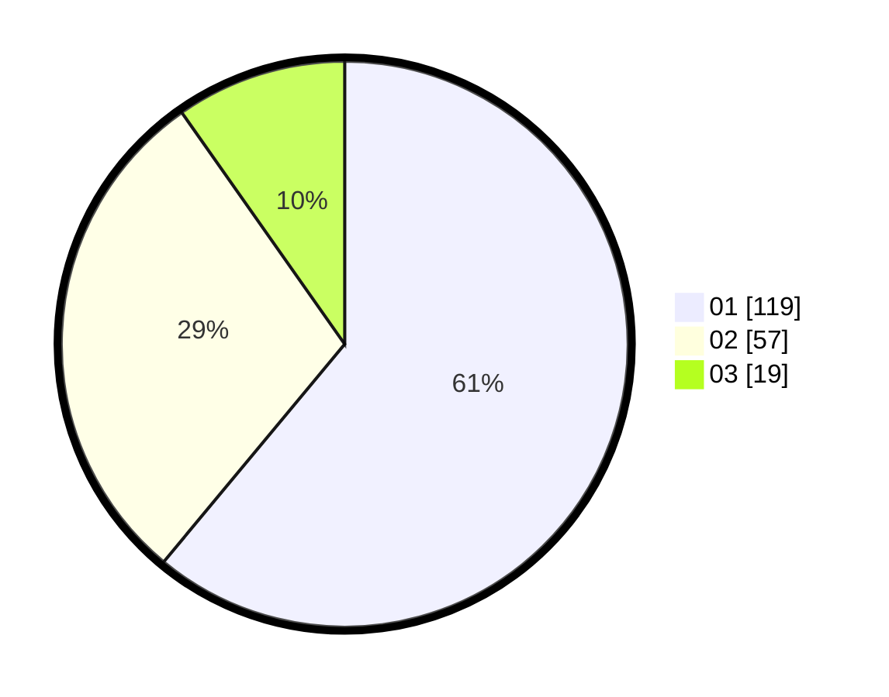

# Hasil

Hasil perolehan suara paslon dapat dilihat pada file paslon-01.txt, paslon-02.txt, dan paslon-03.txt.

Jika tidak ada, artinya data tersebut belum ada pada SIREKAP.

## Perolehan Suara

 * Paslon 01: **119**.
 * Paslon 02: **57**.
 * Paslon 03: **19**.

## Foto C Plano

https://sirekap-obj-formc.kpu.go.id/279a/pemilu/ppwp/31/74/03/10/04/3174031004077-20240216-024542--f3a38f2e-684c-41b7-be74-298e3d02ddcb.jpg

https://sirekap-obj-formc.kpu.go.id/279a/pemilu/ppwp/31/74/03/10/04/3174031004077-20240216-024545--2fe4891c-fde1-486a-9e65-7185f3a5f392.jpg

https://sirekap-obj-formc.kpu.go.id/279a/pemilu/ppwp/31/74/03/10/04/3174031004077-20240216-024544--ee674d36-f897-4241-ac09-129cc77804a1.jpg

## DATA PEMILIH TETAP

Jumlah pemilih dalam DPT: **245**.
 * L: **130**.
 * P: **115**.

## DATA PENGGUNA HAK PILIH

Jumlah pengguna hak pilih dalam DPT: **191**.
 * L: **101**.
 * P: **90**.

Jumlah pengguna hak pilih dalam DPTb: **3**.
 * L: **0**.
 * P: **3**.

Jumlah pengguna hak pilih dalam DPK: **1**.
 * L: **1**.
 * P: **0**.

Jumlah pengguna hak pilih: **195**.
 * L: **102**.
 * P: **93**.

## JUMLAH SUARA SAH DAN TIDAK SAH

JUMLAH SELURUH SUARA SAH: **195**.

JUMLAH SUARA TIDAK SAH: **0**.

JUMLAH SELURUH SUARA SAH DAN SUARA TIDAK SAH: **195**.
