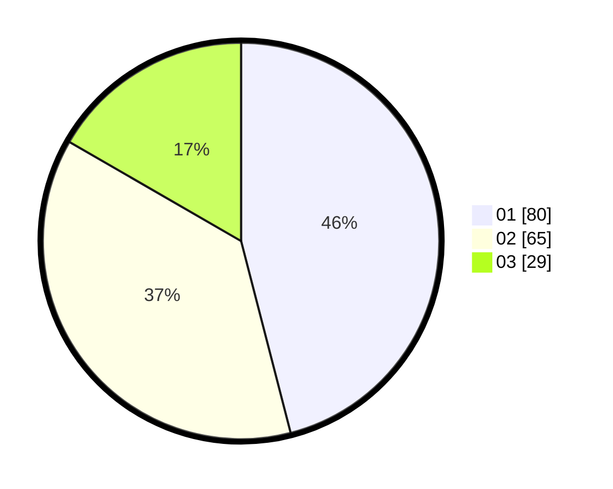

# Hasil

Hasil perolehan suara paslon dapat dilihat pada file paslon-01.txt, paslon-02.txt, dan paslon-03.txt.

Jika tidak ada, artinya data tersebut belum ada pada SIREKAP.

## Perolehan Suara

 * Paslon 01: **80**.
 * Paslon 02: **65**.
 * Paslon 03: **29**.

## Foto C Plano

https://sirekap-obj-formc.kpu.go.id/e338/pemilu/ppwp/31/74/03/10/04/3174031004078-20240215-204804--4aed9339-b16c-437a-bbaf-d95d68dc3ef6.jpg

https://sirekap-obj-formc.kpu.go.id/e338/pemilu/ppwp/31/74/03/10/04/3174031004078-20240215-204807--9dbace7e-1003-4c5f-af84-16e0e62c632c.jpg

https://sirekap-obj-formc.kpu.go.id/e338/pemilu/ppwp/31/74/03/10/04/3174031004078-20240215-204806--faa8f167-7255-45d4-a5c9-429c7d3d0b1d.jpg

## DATA PEMILIH TETAP

Jumlah pemilih dalam DPT: **237**.
 * L: **122**.
 * P: **115**.

## DATA PENGGUNA HAK PILIH

Jumlah pengguna hak pilih dalam DPT: **172**.
 * L: **84**.
 * P: **88**.

Jumlah pengguna hak pilih dalam DPTb: **1**.
 * L: **0**.
 * P: **1**.

Jumlah pengguna hak pilih dalam DPK: **1**.
 * L: **1**.
 * P: **0**.

Jumlah pengguna hak pilih: **174**.
 * L: **85**.
 * P: **89**.

## JUMLAH SUARA SAH DAN TIDAK SAH

JUMLAH SELURUH SUARA SAH: **174**.

JUMLAH SUARA TIDAK SAH: **0**.

JUMLAH SELURUH SUARA SAH DAN SUARA TIDAK SAH: **174**.
