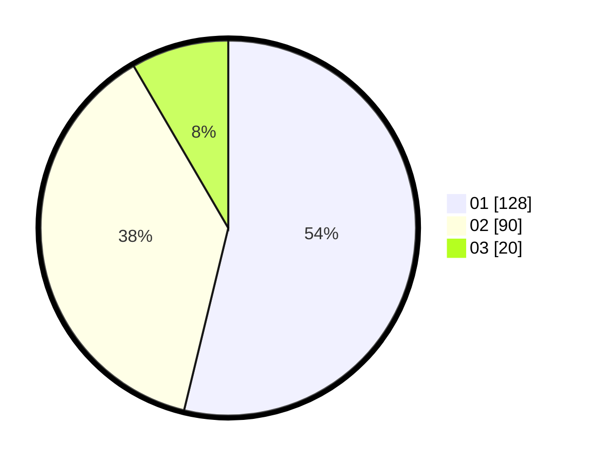

# Hasil

Hasil perolehan suara paslon dapat dilihat pada file paslon-01.txt, paslon-02.txt, dan paslon-03.txt.

Jika tidak ada, artinya data tersebut belum ada pada SIREKAP.

## Perolehan Suara

 * Paslon 01: **128**.
 * Paslon 02: **90**.
 * Paslon 03: **20**.

## Foto C Plano

https://sirekap-obj-formc.kpu.go.id/2ce8/pemilu/ppwp/31/74/03/10/04/3174031004083-20240216-053422--5fd94561-d4ac-4585-a195-7da8eb71d124.jpg

https://sirekap-obj-formc.kpu.go.id/2ce8/pemilu/ppwp/31/74/03/10/04/3174031004083-20240216-053436--d27e3d29-dddc-4ae4-ba3e-809500f440f4.jpg

https://sirekap-obj-formc.kpu.go.id/2ce8/pemilu/ppwp/31/74/03/10/04/3174031004083-20240216-053427--cb546935-cb89-41b2-bb2e-fcdfad9f1fee.jpg

## DATA PEMILIH TETAP

Jumlah pemilih dalam DPT: **286**.
 * L: **143**.
 * P: **143**.

## DATA PENGGUNA HAK PILIH

Jumlah pengguna hak pilih dalam DPT: **237**.
 * L: **117**.
 * P: **120**.

Jumlah pengguna hak pilih dalam DPTb: **3**.
 * L: **2**.
 * P: **1**.

Jumlah pengguna hak pilih dalam DPK: **1**.
 * L: **1**.
 * P: **0**.

Jumlah pengguna hak pilih: **241**.
 * L: **120**.
 * P: **121**.

## JUMLAH SUARA SAH DAN TIDAK SAH

JUMLAH SELURUH SUARA SAH: **238**.

JUMLAH SUARA TIDAK SAH: **3**.

JUMLAH SELURUH SUARA SAH DAN SUARA TIDAK SAH: **241**.
