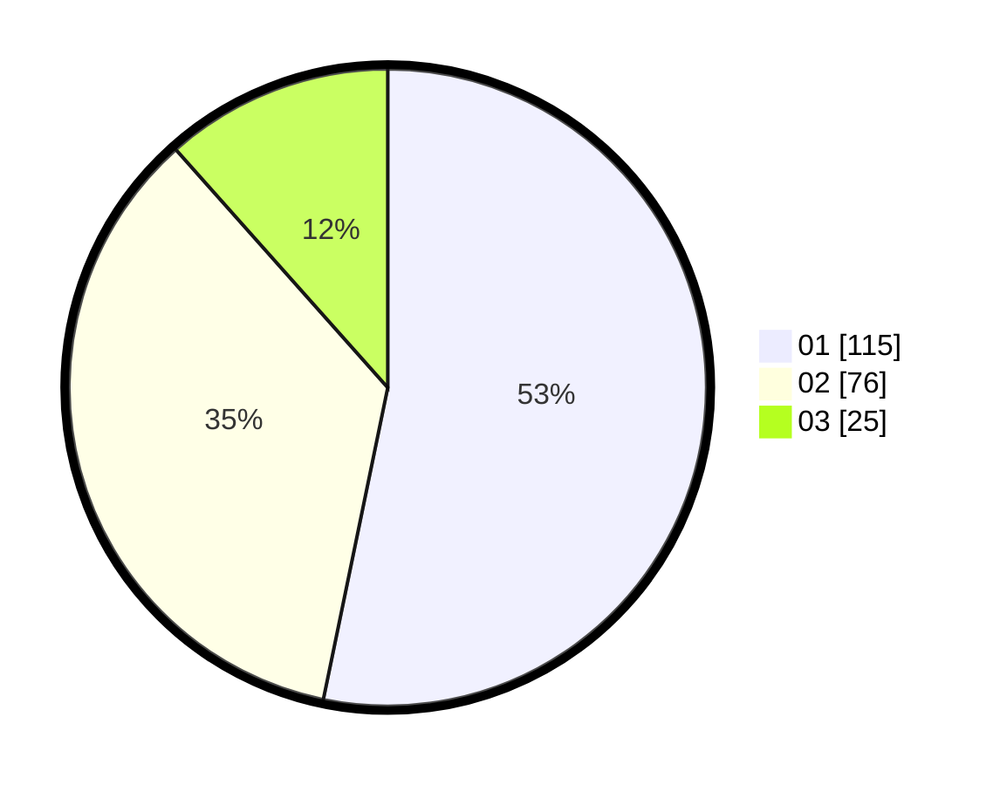

# Hasil

Hasil perolehan suara paslon dapat dilihat pada file paslon-01.txt, paslon-02.txt, dan paslon-03.txt.

Jika tidak ada, artinya data tersebut belum ada pada SIREKAP.

## Perolehan Suara

 * Paslon 01: **115**.
 * Paslon 02: **76**.
 * Paslon 03: **25**.

## Foto C Plano

https://sirekap-obj-formc.kpu.go.id/5c40/pemilu/ppwp/31/74/03/10/04/3174031004084-20240216-022402--400a8957-a4a4-477d-8246-1854a99ba0e4.jpg

https://sirekap-obj-formc.kpu.go.id/5c40/pemilu/ppwp/31/74/03/10/04/3174031004084-20240216-022403--986a2590-af53-4fcf-94a8-f1f04e96ea43.jpg

https://sirekap-obj-formc.kpu.go.id/5c40/pemilu/ppwp/31/74/03/10/04/3174031004084-20240216-022403--3bf14f50-aa28-4129-82e9-a02ecee931d7.jpg

## DATA PEMILIH TETAP

Jumlah pemilih dalam DPT: **281**.
 * L: **144**.
 * P: **137**.

## DATA PENGGUNA HAK PILIH

Jumlah pengguna hak pilih dalam DPT: **213**.
 * L: **106**.
 * P: **107**.

Jumlah pengguna hak pilih dalam DPTb: **4**.
 * L: **2**.
 * P: **2**.

Jumlah pengguna hak pilih dalam DPK: **0**.
 * L: **0**.
 * P: **0**.

Jumlah pengguna hak pilih: **217**.
 * L: **108**.
 * P: **109**.

## JUMLAH SUARA SAH DAN TIDAK SAH

JUMLAH SELURUH SUARA SAH: **216**.

JUMLAH SUARA TIDAK SAH: **1**.

JUMLAH SELURUH SUARA SAH DAN SUARA TIDAK SAH: **217**.
