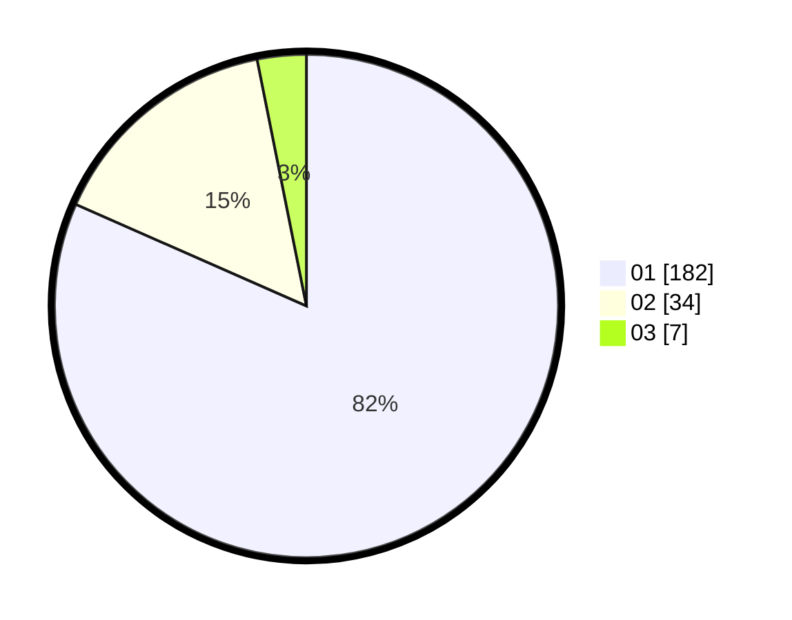

# Hasil

Hasil perolehan suara paslon dapat dilihat pada file paslon-01.txt, paslon-02.txt, dan paslon-03.txt.

Jika tidak ada, artinya data tersebut belum ada pada SIREKAP.

## Perolehan Suara

 * Paslon 01: **182**.
 * Paslon 02: **34**.
 * Paslon 03: **7**.

## Foto C Plano

https://sirekap-obj-formc.kpu.go.id/84fb/pemilu/ppwp/31/74/03/10/04/3174031004086-20240216-194538--f5a1954a-1b6d-40d6-95e9-3b2189f78a9b.jpg

https://sirekap-obj-formc.kpu.go.id/84fb/pemilu/ppwp/31/74/03/10/04/3174031004086-20240216-194540--fdf72945-3065-43f7-b61d-f0861dcee823.jpg

https://sirekap-obj-formc.kpu.go.id/84fb/pemilu/ppwp/31/74/03/10/04/3174031004086-20240216-194539--578e4028-471d-46ba-b3a7-6c6212cea8a0.jpg

## DATA PEMILIH TETAP

Jumlah pemilih dalam DPT: **252**.
 * L: **126**.
 * P: **126**.

## DATA PENGGUNA HAK PILIH

Jumlah pengguna hak pilih dalam DPT: **221**.
 * L: **111**.
 * P: **110**.

Jumlah pengguna hak pilih dalam DPTb: **6**.
 * L: **4**.
 * P: **2**.

Jumlah pengguna hak pilih dalam DPK: **3**.
 * L: **1**.
 * P: **2**.

Jumlah pengguna hak pilih: **230**.
 * L: **116**.
 * P: **114**.

## JUMLAH SUARA SAH DAN TIDAK SAH

JUMLAH SELURUH SUARA SAH: **223**.

JUMLAH SUARA TIDAK SAH: **7**.

JUMLAH SELURUH SUARA SAH DAN SUARA TIDAK SAH: **230**.
