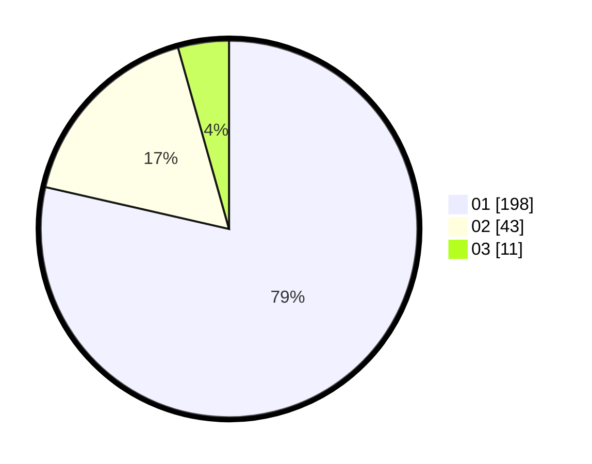

# Hasil

Hasil perolehan suara paslon dapat dilihat pada file paslon-01.txt, paslon-02.txt, dan paslon-03.txt.

Jika tidak ada, artinya data tersebut belum ada pada SIREKAP.

## Perolehan Suara

 * Paslon 01: **198**.
 * Paslon 02: **43**.
 * Paslon 03: **11**.

## Foto C Plano

https://sirekap-obj-formc.kpu.go.id/ce87/pemilu/ppwp/31/74/03/10/04/3174031004087-20240216-022921--47d67b3f-457c-4e97-bd5b-d4752de3ca47.jpg

https://sirekap-obj-formc.kpu.go.id/ce87/pemilu/ppwp/31/74/03/10/04/3174031004087-20240216-022922--5fe9a1c8-3b36-4b13-9a78-41e3f918c0bb.jpg

https://sirekap-obj-formc.kpu.go.id/ce87/pemilu/ppwp/31/74/03/10/04/3174031004087-20240216-022922--f7c4cd7f-41d1-4501-ab89-ac57f6ac6ffc.jpg

## DATA PEMILIH TETAP

Jumlah pemilih dalam DPT: **281**.
 * L: **137**.
 * P: **144**.

## DATA PENGGUNA HAK PILIH

Jumlah pengguna hak pilih dalam DPT: **244**.
 * L: **114**.
 * P: **130**.

Jumlah pengguna hak pilih dalam DPTb: **0**.
 * L: **0**.
 * P: **0**.

Jumlah pengguna hak pilih dalam DPK: **6**.
 * L: **3**.
 * P: **3**.

Jumlah pengguna hak pilih: **255**.
 * L: **122**.
 * P: **133**.

## JUMLAH SUARA SAH DAN TIDAK SAH

JUMLAH SELURUH SUARA SAH: **252**.

JUMLAH SUARA TIDAK SAH: **3**.

JUMLAH SELURUH SUARA SAH DAN SUARA TIDAK SAH: **255**.
