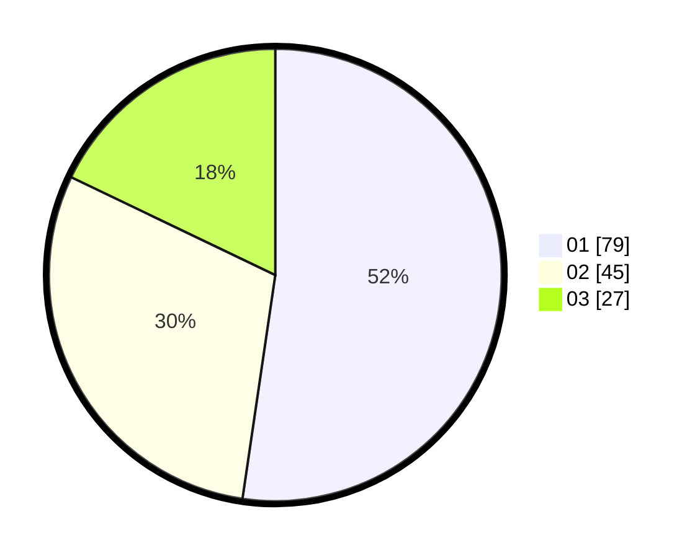

# Hasil

Hasil perolehan suara paslon dapat dilihat pada file paslon-01.txt, paslon-02.txt, dan paslon-03.txt.

Jika tidak ada, artinya data tersebut belum ada pada SIREKAP.

## Perolehan Suara

 * Paslon 01: **79**.
 * Paslon 02: **45**.
 * Paslon 03: **27**.

## Foto C Plano

https://sirekap-obj-formc.kpu.go.id/e99c/pemilu/ppwp/31/74/03/10/04/3174031004090-20240216-044953--9dbc05f7-98dd-4708-87b3-f6f1ffb62163.jpg

https://sirekap-obj-formc.kpu.go.id/e99c/pemilu/ppwp/31/74/03/10/04/3174031004090-20240216-045004--bde80a20-0743-40b9-9a71-64f7f9218f83.jpg

https://sirekap-obj-formc.kpu.go.id/e99c/pemilu/ppwp/31/74/03/10/04/3174031004090-20240216-050147--c359e3c9-6202-4cb3-8747-3b902d1f0ff3.jpg

## DATA PEMILIH TETAP

Jumlah pemilih dalam DPT: **214**.
 * L: **115**.
 * P: **99**.

## DATA PENGGUNA HAK PILIH

Jumlah pengguna hak pilih dalam DPT: **148**.
 * L: **77**.
 * P: **71**.

Jumlah pengguna hak pilih dalam DPTb: **3**.
 * L: **0**.
 * P: **3**.

Jumlah pengguna hak pilih dalam DPK: **1**.
 * L: **1**.
 * P: **0**.

Jumlah pengguna hak pilih: **152**.
 * L: **78**.
 * P: **74**.

## JUMLAH SUARA SAH DAN TIDAK SAH

JUMLAH SELURUH SUARA SAH: **151**.

JUMLAH SUARA TIDAK SAH: **1**.

JUMLAH SELURUH SUARA SAH DAN SUARA TIDAK SAH: **152**.
