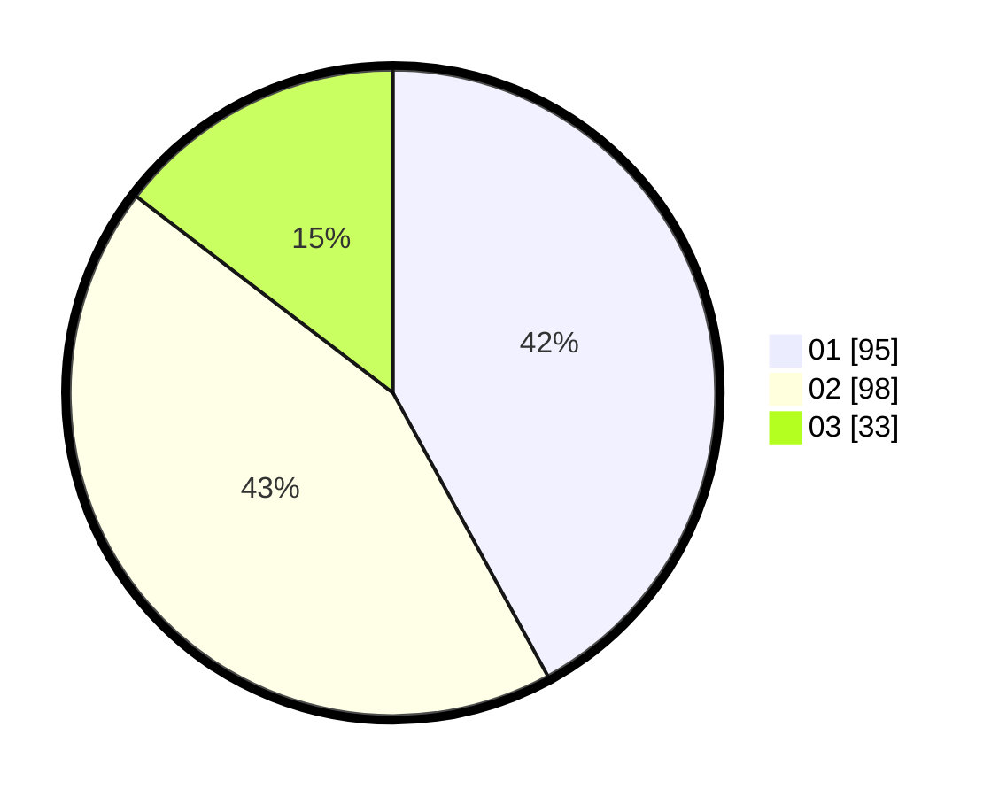

# Hasil

Hasil perolehan suara paslon dapat dilihat pada file paslon-01.txt, paslon-02.txt, dan paslon-03.txt.

Jika tidak ada, artinya data tersebut belum ada pada SIREKAP.

## Perolehan Suara

 * Paslon 01: **95**.
 * Paslon 02: **98**.
 * Paslon 03: **33**.

## Foto C Plano

https://sirekap-obj-formc.kpu.go.id/c5bd/pemilu/ppwp/31/74/03/10/04/3174031004095-20240216-030608--6a4a00ae-2eb5-4c48-9666-b9b7006d6a12.jpg

https://sirekap-obj-formc.kpu.go.id/c5bd/pemilu/ppwp/31/74/03/10/04/3174031004095-20240216-030610--7ee2fd79-a13e-4e01-9afd-8881b575fabf.jpg

https://sirekap-obj-formc.kpu.go.id/c5bd/pemilu/ppwp/31/74/03/10/04/3174031004095-20240216-030609--98c2310e-fe40-4157-96fc-a8c3bb99e67f.jpg

## DATA PEMILIH TETAP

Jumlah pemilih dalam DPT: **277**.
 * L: **137**.
 * P: **140**.

## DATA PENGGUNA HAK PILIH

Jumlah pengguna hak pilih dalam DPT: **217**.
 * L: **102**.
 * P: **115**.

Jumlah pengguna hak pilih dalam DPTb: **7**.
 * L: **5**.
 * P: **2**.

Jumlah pengguna hak pilih dalam DPK: **4**.
 * L: **3**.
 * P: **1**.

Jumlah pengguna hak pilih: **228**.
 * L: **110**.
 * P: **118**.

## JUMLAH SUARA SAH DAN TIDAK SAH

JUMLAH SELURUH SUARA SAH: **226**.

JUMLAH SUARA TIDAK SAH: **2**.

JUMLAH SELURUH SUARA SAH DAN SUARA TIDAK SAH: **228**.
