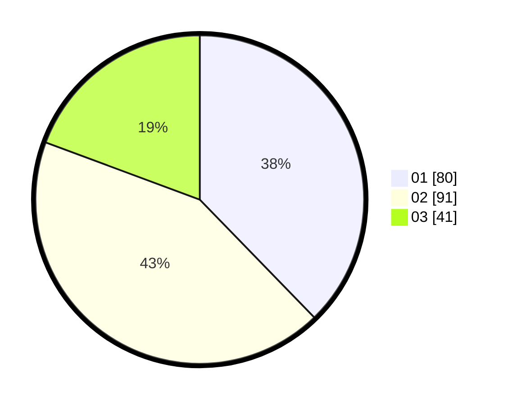

# Hasil

Hasil perolehan suara paslon dapat dilihat pada file paslon-01.txt, paslon-02.txt, dan paslon-03.txt.

Jika tidak ada, artinya data tersebut belum ada pada SIREKAP.

## Perolehan Suara

 * Paslon 01: **80**.
 * Paslon 02: **91**.
 * Paslon 03: **41**.

## Foto C Plano

https://sirekap-obj-formc.kpu.go.id/369e/pemilu/ppwp/31/74/03/10/04/3174031004098-20240215-201330--83d64806-7ad1-401a-86bb-d66cdb63d1e3.jpg

https://sirekap-obj-formc.kpu.go.id/369e/pemilu/ppwp/31/74/03/10/04/3174031004098-20240215-201352--1f795bb0-3544-4240-9381-5c104084d1b0.jpg

https://sirekap-obj-formc.kpu.go.id/369e/pemilu/ppwp/31/74/03/10/04/3174031004098-20240215-201341--f38216da-4e41-48f2-88a0-35121458055a.jpg

## DATA PEMILIH TETAP

Jumlah pemilih dalam DPT: **249**.
 * L: **122**.
 * P: **127**.

## DATA PENGGUNA HAK PILIH

Jumlah pengguna hak pilih dalam DPT: **209**.
 * L: **102**.
 * P: **107**.

Jumlah pengguna hak pilih dalam DPTb: **3**.
 * L: **0**.
 * P: **3**.

Jumlah pengguna hak pilih dalam DPK: **2**.
 * L: **1**.
 * P: **1**.

Jumlah pengguna hak pilih: **214**.
 * L: **103**.
 * P: **111**.

## JUMLAH SUARA SAH DAN TIDAK SAH

JUMLAH SELURUH SUARA SAH: **212**.

JUMLAH SUARA TIDAK SAH: **2**.

JUMLAH SELURUH SUARA SAH DAN SUARA TIDAK SAH: **214**.
