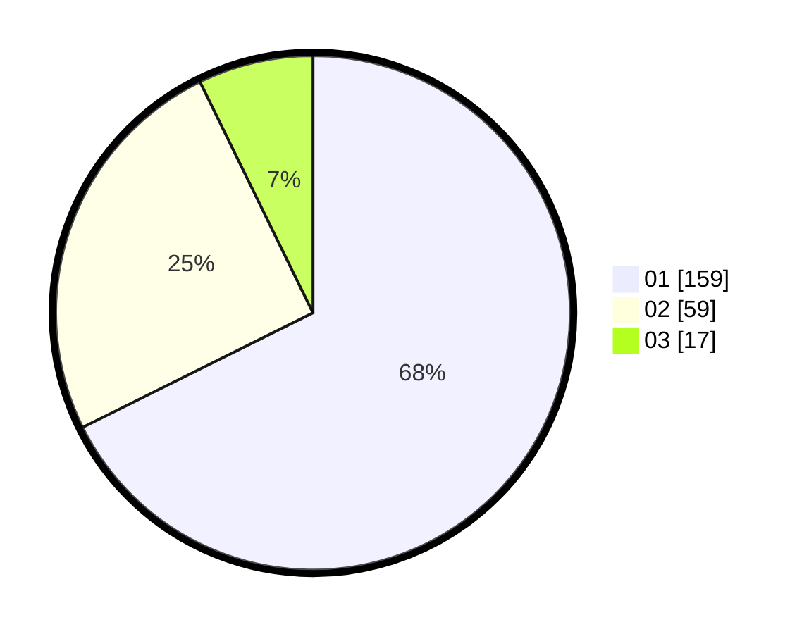

# Hasil

Hasil perolehan suara paslon dapat dilihat pada file paslon-01.txt, paslon-02.txt, dan paslon-03.txt.

Jika tidak ada, artinya data tersebut belum ada pada SIREKAP.

## Perolehan Suara

 * Paslon 01: **159**.
 * Paslon 02: **59**.
 * Paslon 03: **17**.

## Foto C Plano

https://sirekap-obj-formc.kpu.go.id/4f13/pemilu/ppwp/31/74/03/10/04/3174031004102-20240214-203423--92e8490b-cc69-47d1-b80b-78e984d60780.jpg

https://sirekap-obj-formc.kpu.go.id/4f13/pemilu/ppwp/31/74/03/10/04/3174031004102-20240214-203435--95579361-d7ae-492a-b94b-f7a889d42d4a.jpg

https://sirekap-obj-formc.kpu.go.id/4f13/pemilu/ppwp/31/74/03/10/04/3174031004102-20240214-213051--74803f4a-3591-4b03-8387-df8ce85d40ff.jpg

## DATA PEMILIH TETAP

Jumlah pemilih dalam DPT: **290**.
 * L: **143**.
 * P: **147**.

## DATA PENGGUNA HAK PILIH

Jumlah pengguna hak pilih dalam DPT: **234**.
 * L: **109**.
 * P: **125**.

Jumlah pengguna hak pilih dalam DPTb: **4**.
 * L: **3**.
 * P: **1**.

Jumlah pengguna hak pilih dalam DPK: **0**.
 * L: **0**.
 * P: **0**.

Jumlah pengguna hak pilih: **238**.
 * L: **112**.
 * P: **126**.

## JUMLAH SUARA SAH DAN TIDAK SAH

JUMLAH SELURUH SUARA SAH: **235**.

JUMLAH SUARA TIDAK SAH: **3**.

JUMLAH SELURUH SUARA SAH DAN SUARA TIDAK SAH: **238**.
