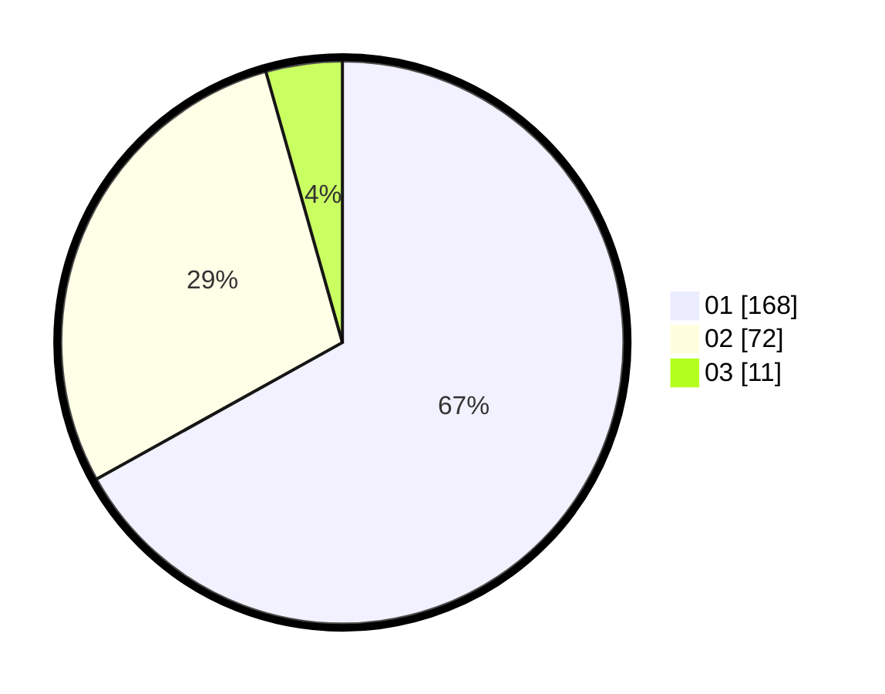

# Hasil

Hasil perolehan suara paslon dapat dilihat pada file paslon-01.txt, paslon-02.txt, dan paslon-03.txt.

Jika tidak ada, artinya data tersebut belum ada pada SIREKAP.

## Perolehan Suara

 * Paslon 01: **168**.
 * Paslon 02: **72**.
 * Paslon 03: **11**.

## Foto C Plano

https://sirekap-obj-formc.kpu.go.id/597a/pemilu/ppwp/31/74/03/10/04/3174031004103-20240215-003121--f11b789a-7dd1-4ae2-84ad-53878e0f1b1a.jpg

https://sirekap-obj-formc.kpu.go.id/597a/pemilu/ppwp/31/74/03/10/04/3174031004103-20240215-003140--f04bf1bd-5d28-4351-acb0-7f77c1f274b2.jpg

https://sirekap-obj-formc.kpu.go.id/597a/pemilu/ppwp/31/74/03/10/04/3174031004103-20240215-003553--595df4bb-6357-4b07-b90c-e9c928151310.jpg

## DATA PEMILIH TETAP

Jumlah pemilih dalam DPT: **291**.
 * L: **142**.
 * P: **149**.

## DATA PENGGUNA HAK PILIH

Jumlah pengguna hak pilih dalam DPT: **247**.
 * L: **122**.
 * P: **125**.

Jumlah pengguna hak pilih dalam DPTb: **1**.
 * L: **0**.
 * P: **1**.

Jumlah pengguna hak pilih dalam DPK: **4**.
 * L: **2**.
 * P: **2**.

Jumlah pengguna hak pilih: **252**.
 * L: **124**.
 * P: **128**.

## JUMLAH SUARA SAH DAN TIDAK SAH

JUMLAH SELURUH SUARA SAH: **251**.

JUMLAH SUARA TIDAK SAH: **1**.

JUMLAH SELURUH SUARA SAH DAN SUARA TIDAK SAH: **252**.
