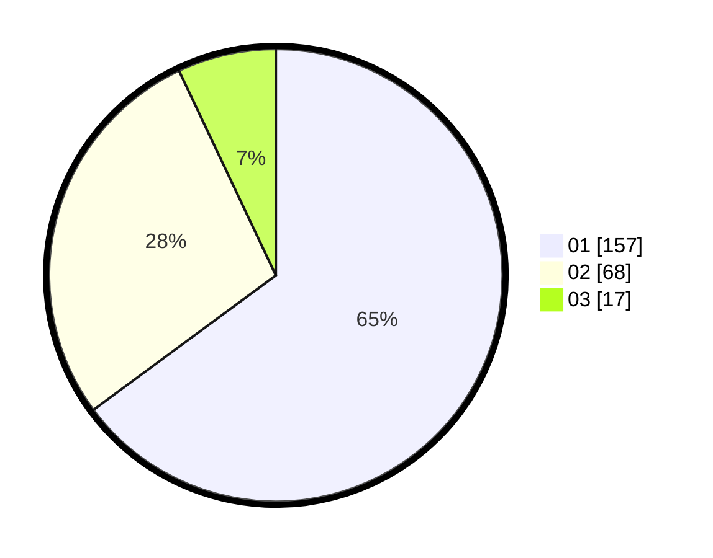

# Hasil

Hasil perolehan suara paslon dapat dilihat pada file paslon-01.txt, paslon-02.txt, dan paslon-03.txt.

Jika tidak ada, artinya data tersebut belum ada pada SIREKAP.

## Perolehan Suara

 * Paslon 01: **157**.
 * Paslon 02: **68**.
 * Paslon 03: **17**.

## Foto C Plano

https://sirekap-obj-formc.kpu.go.id/f672/pemilu/ppwp/31/74/03/10/05/3174031005002-20240219-111456--45e38e54-2d8a-4d2c-a93f-06a690c9017a.jpg

https://sirekap-obj-formc.kpu.go.id/f672/pemilu/ppwp/31/74/03/10/05/3174031005002-20240219-111545--7632efa9-31b8-484c-b520-49f5c98633f6.jpg

https://sirekap-obj-formc.kpu.go.id/f672/pemilu/ppwp/31/74/03/10/05/3174031005002-20240219-111904--333e50d9-36a9-444f-8b44-323bdf4a8a4c.jpg

## DATA PEMILIH TETAP

Jumlah pemilih dalam DPT: **284**.
 * L: **150**.
 * P: **134**.

## DATA PENGGUNA HAK PILIH

Jumlah pengguna hak pilih dalam DPT: **237**.
 * L: **128**.
 * P: **109**.

Jumlah pengguna hak pilih dalam DPTb: **8**.
 * L: **5**.
 * P: **3**.

Jumlah pengguna hak pilih dalam DPK: **1**.
 * L: **0**.
 * P: **1**.

Jumlah pengguna hak pilih: **246**.
 * L: **133**.
 * P: **113**.

## JUMLAH SUARA SAH DAN TIDAK SAH

JUMLAH SELURUH SUARA SAH: **242**.

JUMLAH SUARA TIDAK SAH: **4**.

JUMLAH SELURUH SUARA SAH DAN SUARA TIDAK SAH: **246**.
