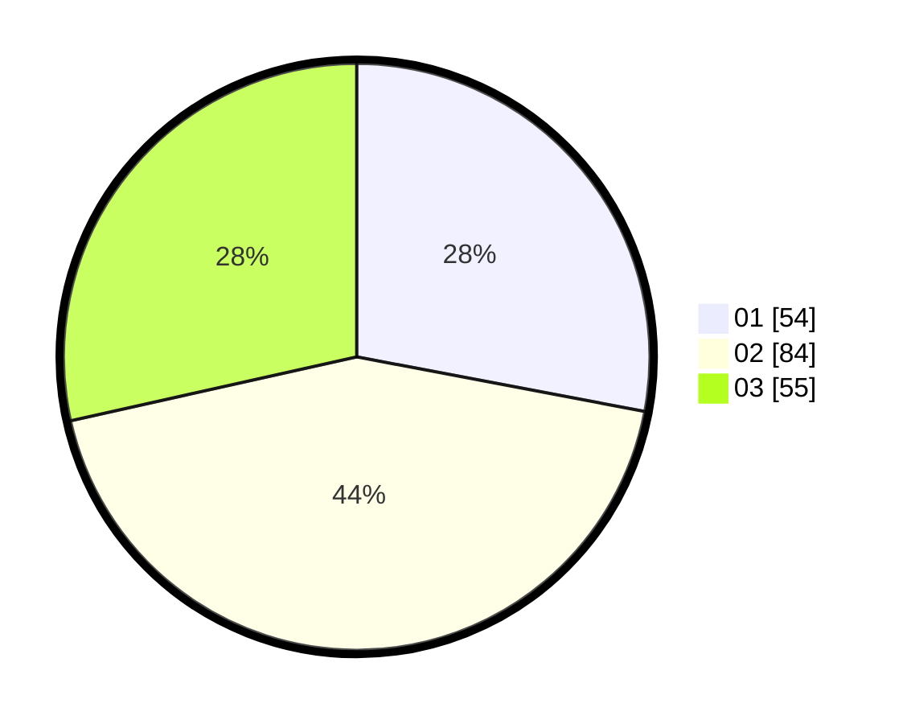

# Hasil

Hasil perolehan suara paslon dapat dilihat pada file paslon-01.txt, paslon-02.txt, dan paslon-03.txt.

Jika tidak ada, artinya data tersebut belum ada pada SIREKAP.

## Perolehan Suara

 * Paslon 01: **54**.
 * Paslon 02: **84**.
 * Paslon 03: **55**.

## Foto C Plano

https://sirekap-obj-formc.kpu.go.id/7edb/pemilu/ppwp/31/74/03/10/05/3174031005011-20240216-074948--7b0eeb5b-9bd7-4e38-80f7-91c9634f102c.jpg

https://sirekap-obj-formc.kpu.go.id/7edb/pemilu/ppwp/31/74/03/10/05/3174031005011-20240216-074950--e69ddb3b-ad42-4fac-8eb9-b7bd26f05259.jpg

https://sirekap-obj-formc.kpu.go.id/7edb/pemilu/ppwp/31/74/03/10/05/3174031005011-20240216-074949--a72ee7b3-ef8c-42b9-9574-745772f41f5c.jpg

## DATA PEMILIH TETAP

Jumlah pemilih dalam DPT: **286**.
 * L: **149**.
 * P: **137**.

## DATA PENGGUNA HAK PILIH

Jumlah pengguna hak pilih dalam DPT: **186**.
 * L: **97**.
 * P: **89**.

Jumlah pengguna hak pilih dalam DPTb: **5**.
 * L: **3**.
 * P: **2**.

Jumlah pengguna hak pilih dalam DPK: **3**.
 * L: **2**.
 * P: **1**.

Jumlah pengguna hak pilih: **194**.
 * L: **102**.
 * P: **92**.

## JUMLAH SUARA SAH DAN TIDAK SAH

JUMLAH SELURUH SUARA SAH: **193**.

JUMLAH SUARA TIDAK SAH: **1**.

JUMLAH SELURUH SUARA SAH DAN SUARA TIDAK SAH: **194**.
