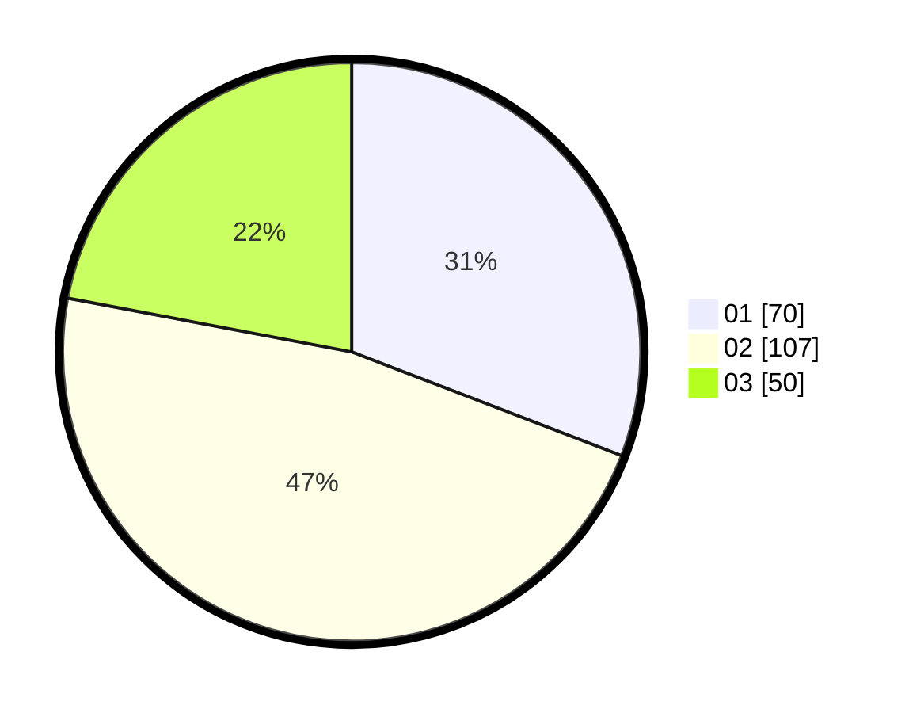

# Hasil

Hasil perolehan suara paslon dapat dilihat pada file paslon-01.txt, paslon-02.txt, dan paslon-03.txt.

Jika tidak ada, artinya data tersebut belum ada pada SIREKAP.

## Perolehan Suara

 * Paslon 01: **70**.
 * Paslon 02: **107**.
 * Paslon 03: **50**.

## Foto C Plano

https://sirekap-obj-formc.kpu.go.id/9a82/pemilu/ppwp/31/74/03/10/05/3174031005019-20240214-190830--a761617a-6531-4de9-a7b7-4a272875e998.jpg

https://sirekap-obj-formc.kpu.go.id/9a82/pemilu/ppwp/31/74/03/10/05/3174031005019-20240214-185500--7cfd6710-638a-47e5-8faa-0d8bf5f54c81.jpg

https://sirekap-obj-formc.kpu.go.id/9a82/pemilu/ppwp/31/74/03/10/05/3174031005019-20240214-183102--93e628dd-ad38-40ef-992b-a2980b8da9e3.jpg

## DATA PEMILIH TETAP

Jumlah pemilih dalam DPT: **287**.
 * L: **147**.
 * P: **140**.

## DATA PENGGUNA HAK PILIH

Jumlah pengguna hak pilih dalam DPT: **226**.
 * L: **112**.
 * P: **114**.

Jumlah pengguna hak pilih dalam DPTb: **2**.
 * L: **2**.
 * P: **0**.

Jumlah pengguna hak pilih dalam DPK: **1**.
 * L: **1**.
 * P: **0**.

Jumlah pengguna hak pilih: **229**.
 * L: **115**.
 * P: **114**.

## JUMLAH SUARA SAH DAN TIDAK SAH

JUMLAH SELURUH SUARA SAH: **227**.

JUMLAH SUARA TIDAK SAH: **2**.

JUMLAH SELURUH SUARA SAH DAN SUARA TIDAK SAH: **229**.
