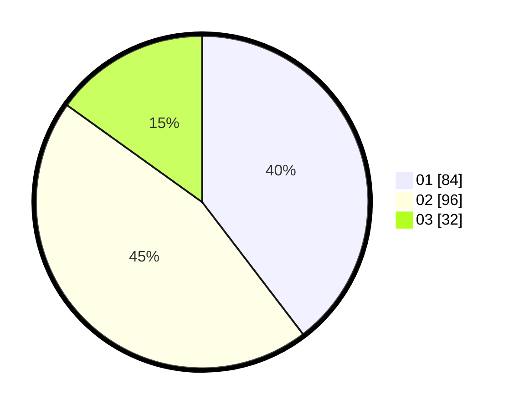

# Hasil

Hasil perolehan suara paslon dapat dilihat pada file paslon-01.txt, paslon-02.txt, dan paslon-03.txt.

Jika tidak ada, artinya data tersebut belum ada pada SIREKAP.

## Perolehan Suara

 * Paslon 01: **84**.
 * Paslon 02: **96**.
 * Paslon 03: **32**.

## Foto C Plano

https://sirekap-obj-formc.kpu.go.id/f9a6/pemilu/ppwp/31/74/03/10/05/3174031005020-20240216-142029--02c40218-091c-4485-afa4-c84073d9b816.jpg

https://sirekap-obj-formc.kpu.go.id/f9a6/pemilu/ppwp/31/74/03/10/05/3174031005020-20240216-142031--71e603ac-51dd-4339-b029-d3b8fb0ee129.jpg

https://sirekap-obj-formc.kpu.go.id/f9a6/pemilu/ppwp/31/74/03/10/05/3174031005020-20240216-142030--e36603cd-6a91-4f56-a117-bfe28a182960.jpg

## DATA PEMILIH TETAP

Jumlah pemilih dalam DPT: **279**.
 * L: **138**.
 * P: **141**.

## DATA PENGGUNA HAK PILIH

Jumlah pengguna hak pilih dalam DPT: **216**.
 * L: **98**.
 * P: **118**.

Jumlah pengguna hak pilih dalam DPTb: **3**.
 * L: **2**.
 * P: **1**.

Jumlah pengguna hak pilih dalam DPK: **0**.
 * L: **0**.
 * P: **0**.

Jumlah pengguna hak pilih: **219**.
 * L: **100**.
 * P: **119**.

## JUMLAH SUARA SAH DAN TIDAK SAH

JUMLAH SELURUH SUARA SAH: **212**.

JUMLAH SUARA TIDAK SAH: **7**.

JUMLAH SELURUH SUARA SAH DAN SUARA TIDAK SAH: **219**.
