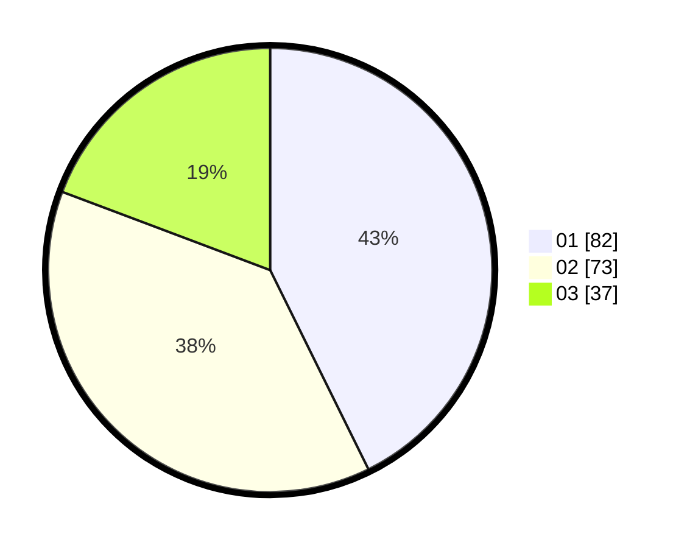

# Hasil

Hasil perolehan suara paslon dapat dilihat pada file paslon-01.txt, paslon-02.txt, dan paslon-03.txt.

Jika tidak ada, artinya data tersebut belum ada pada SIREKAP.

## Perolehan Suara

 * Paslon 01: **82**.
 * Paslon 02: **73**.
 * Paslon 03: **37**.

## Foto C Plano

https://sirekap-obj-formc.kpu.go.id/4cc6/pemilu/ppwp/31/74/03/10/05/3174031005043-20240214-184659--b1acdd88-130a-4dd5-b028-2fbcdade9a45.jpg

https://sirekap-obj-formc.kpu.go.id/4cc6/pemilu/ppwp/31/74/03/10/05/3174031005043-20240214-202055--ae0bad60-8d83-45c0-bc18-2b7dfafb656e.jpg

https://sirekap-obj-formc.kpu.go.id/4cc6/pemilu/ppwp/31/74/03/10/05/3174031005043-20240214-202333--cbb677ec-a485-47e7-98cd-f3a77c7be0c8.jpg

## DATA PEMILIH TETAP

Jumlah pemilih dalam DPT: **255**.
 * L: **118**.
 * P: **137**.

## DATA PENGGUNA HAK PILIH

Jumlah pengguna hak pilih dalam DPT: **188**.
 * L: **81**.
 * P: **107**.

Jumlah pengguna hak pilih dalam DPTb: **1**.
 * L: **0**.
 * P: **1**.

Jumlah pengguna hak pilih dalam DPK: **5**.
 * L: **3**.
 * P: **2**.

Jumlah pengguna hak pilih: **194**.
 * L: **84**.
 * P: **110**.

## JUMLAH SUARA SAH DAN TIDAK SAH

JUMLAH SELURUH SUARA SAH: **192**.

JUMLAH SUARA TIDAK SAH: **2**.

JUMLAH SELURUH SUARA SAH DAN SUARA TIDAK SAH: **194**.
