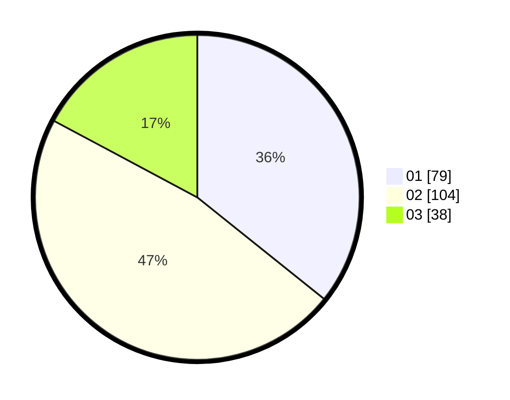

# Hasil

Hasil perolehan suara paslon dapat dilihat pada file paslon-01.txt, paslon-02.txt, dan paslon-03.txt.

Jika tidak ada, artinya data tersebut belum ada pada SIREKAP.

## Perolehan Suara

 * Paslon 01: **79**.
 * Paslon 02: **104**.
 * Paslon 03: **38**.

## Foto C Plano

https://sirekap-obj-formc.kpu.go.id/89cb/pemilu/ppwp/31/74/03/10/05/3174031005045-20240215-143231--5c12a604-d129-473f-9312-3c9c4b0f2774.jpg

https://sirekap-obj-formc.kpu.go.id/89cb/pemilu/ppwp/31/74/03/10/05/3174031005045-20240215-143256--8e8a4e38-f24f-4fab-a00d-0b2387816b33.jpg

https://sirekap-obj-formc.kpu.go.id/89cb/pemilu/ppwp/31/74/03/10/05/3174031005045-20240215-143242--79163475-7911-4cc6-9a3f-1ed42daf4545.jpg

## DATA PEMILIH TETAP

Jumlah pemilih dalam DPT: **291**.
 * L: **182**.
 * P: **109**.

## DATA PENGGUNA HAK PILIH

Jumlah pengguna hak pilih dalam DPT: **218**.
 * L: **133**.
 * P: **85**.

Jumlah pengguna hak pilih dalam DPTb: **3**.
 * L: **2**.
 * P: **1**.

Jumlah pengguna hak pilih dalam DPK: **5**.
 * L: **2**.
 * P: **3**.

Jumlah pengguna hak pilih: **226**.
 * L: **137**.
 * P: **89**.

## JUMLAH SUARA SAH DAN TIDAK SAH

JUMLAH SELURUH SUARA SAH: **221**.

JUMLAH SUARA TIDAK SAH: **5**.

JUMLAH SELURUH SUARA SAH DAN SUARA TIDAK SAH: **226**.
