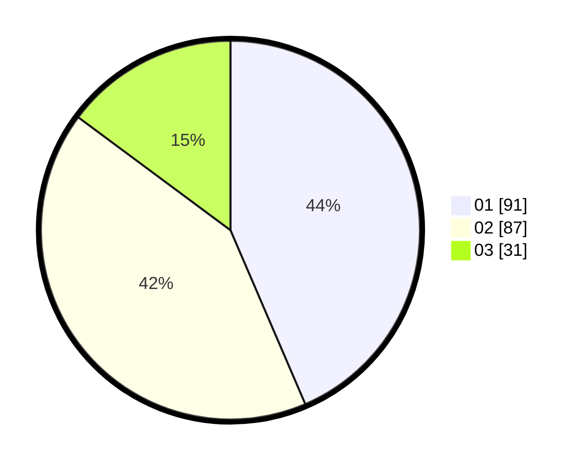

# Hasil

Hasil perolehan suara paslon dapat dilihat pada file paslon-01.txt, paslon-02.txt, dan paslon-03.txt.

Jika tidak ada, artinya data tersebut belum ada pada SIREKAP.

## Perolehan Suara

 * Paslon 01: **91**.
 * Paslon 02: **87**.
 * Paslon 03: **31**.

## Foto C Plano

https://sirekap-obj-formc.kpu.go.id/511f/pemilu/ppwp/31/74/04/10/01/3174041001010-20240216-052604--fe850bca-d14d-4f9f-8abd-dcb683dda615.jpg

https://sirekap-obj-formc.kpu.go.id/511f/pemilu/ppwp/31/74/04/10/01/3174041001010-20240216-053738--5adb6df3-cb4a-4696-acac-151373f0c490.jpg

https://sirekap-obj-formc.kpu.go.id/511f/pemilu/ppwp/31/74/04/10/01/3174041001010-20240216-052611--3b06e5af-2a33-4118-81ed-2d5d5a9f9892.jpg

## DATA PEMILIH TETAP

Jumlah pemilih dalam DPT: **277**.
 * L: **146**.
 * P: **131**.

## DATA PENGGUNA HAK PILIH

Jumlah pengguna hak pilih dalam DPT: **212**.
 * L: **85**.
 * P: **127**.

Jumlah pengguna hak pilih dalam DPTb: **0**.
 * L: **0**.
 * P: **0**.

Jumlah pengguna hak pilih dalam DPK: **0**.
 * L: **0**.
 * P: **0**.

Jumlah pengguna hak pilih: **212**.
 * L: **85**.
 * P: **127**.

## JUMLAH SUARA SAH DAN TIDAK SAH

JUMLAH SELURUH SUARA SAH: **209**.

JUMLAH SUARA TIDAK SAH: **3**.

JUMLAH SELURUH SUARA SAH DAN SUARA TIDAK SAH: **212**.
