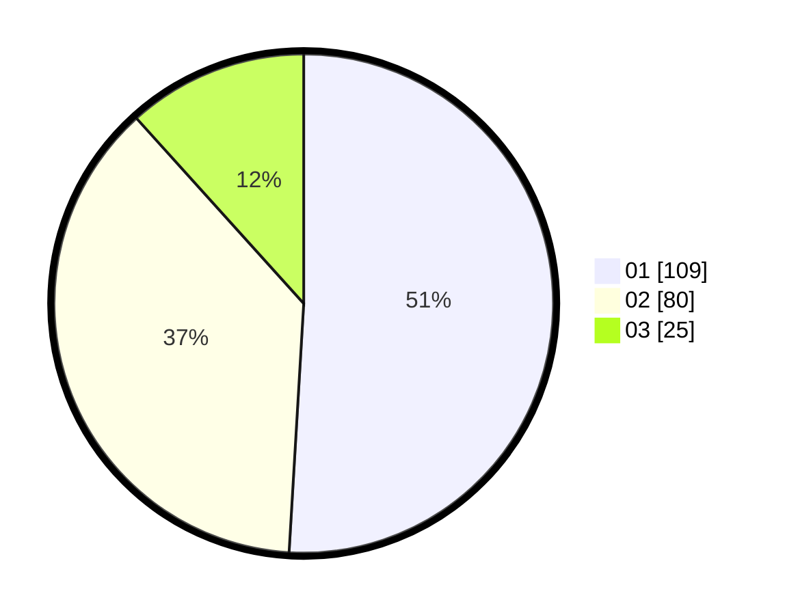

# Hasil

Hasil perolehan suara paslon dapat dilihat pada file paslon-01.txt, paslon-02.txt, dan paslon-03.txt.

Jika tidak ada, artinya data tersebut belum ada pada SIREKAP.

## Perolehan Suara

 * Paslon 01: **109**.
 * Paslon 02: **80**.
 * Paslon 03: **25**.

## Foto C Plano

https://sirekap-obj-formc.kpu.go.id/5b3c/pemilu/ppwp/31/74/04/10/01/3174041001011-20240215-031920--f27fc27b-be08-43b8-b638-43064f41b8ce.jpg

https://sirekap-obj-formc.kpu.go.id/5b3c/pemilu/ppwp/31/74/04/10/01/3174041001011-20240215-032028--4adf2d7b-6fc6-42ea-bf6a-5424fa8bcdd0.jpg

https://sirekap-obj-formc.kpu.go.id/5b3c/pemilu/ppwp/31/74/04/10/01/3174041001011-20240215-032123--b172b2ab-baa3-4452-99a4-7f7c3a3e9b18.jpg

## DATA PEMILIH TETAP

Jumlah pemilih dalam DPT: **275**.
 * L: **150**.
 * P: **125**.

## DATA PENGGUNA HAK PILIH

Jumlah pengguna hak pilih dalam DPT: **213**.
 * L: **114**.
 * P: **99**.

Jumlah pengguna hak pilih dalam DPTb: **0**.
 * L: **0**.
 * P: **0**.

Jumlah pengguna hak pilih dalam DPK: **4**.
 * L: **1**.
 * P: **3**.

Jumlah pengguna hak pilih: **217**.
 * L: **115**.
 * P: **102**.

## JUMLAH SUARA SAH DAN TIDAK SAH

JUMLAH SELURUH SUARA SAH: **214**.

JUMLAH SUARA TIDAK SAH: **3**.

JUMLAH SELURUH SUARA SAH DAN SUARA TIDAK SAH: **217**.
