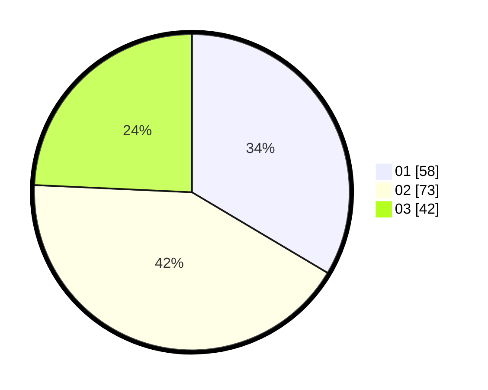

# Hasil

Hasil perolehan suara paslon dapat dilihat pada file paslon-01.txt, paslon-02.txt, dan paslon-03.txt.

Jika tidak ada, artinya data tersebut belum ada pada SIREKAP.

## Perolehan Suara

 * Paslon 01: **58**.
 * Paslon 02: **73**.
 * Paslon 03: **42**.

## Foto C Plano

https://sirekap-obj-formc.kpu.go.id/48d4/pemilu/ppwp/31/74/04/10/01/3174041001013-20240214-202154--6ba59605-d6d5-4da3-9409-198a8fe2ba05.jpg

https://sirekap-obj-formc.kpu.go.id/48d4/pemilu/ppwp/31/74/04/10/01/3174041001013-20240214-210423--c0243a2a-3eeb-4dd1-8c39-4d252401e571.jpg

https://sirekap-obj-formc.kpu.go.id/48d4/pemilu/ppwp/31/74/04/10/01/3174041001013-20240214-202608--820c5499-6c58-4fb4-9cb9-beb6d34912be.jpg

## DATA PEMILIH TETAP

Jumlah pemilih dalam DPT: **221**.
 * L: **111**.
 * P: **110**.

## DATA PENGGUNA HAK PILIH

Jumlah pengguna hak pilih dalam DPT: **163**.
 * L: **81**.
 * P: **82**.

Jumlah pengguna hak pilih dalam DPTb: **8**.
 * L: **1**.
 * P: **7**.

Jumlah pengguna hak pilih dalam DPK: **2**.
 * L: **1**.
 * P: **1**.

Jumlah pengguna hak pilih: **173**.
 * L: **83**.
 * P: **90**.

## JUMLAH SUARA SAH DAN TIDAK SAH

JUMLAH SELURUH SUARA SAH: **173**.

JUMLAH SUARA TIDAK SAH: **0**.

JUMLAH SELURUH SUARA SAH DAN SUARA TIDAK SAH: **173**.
