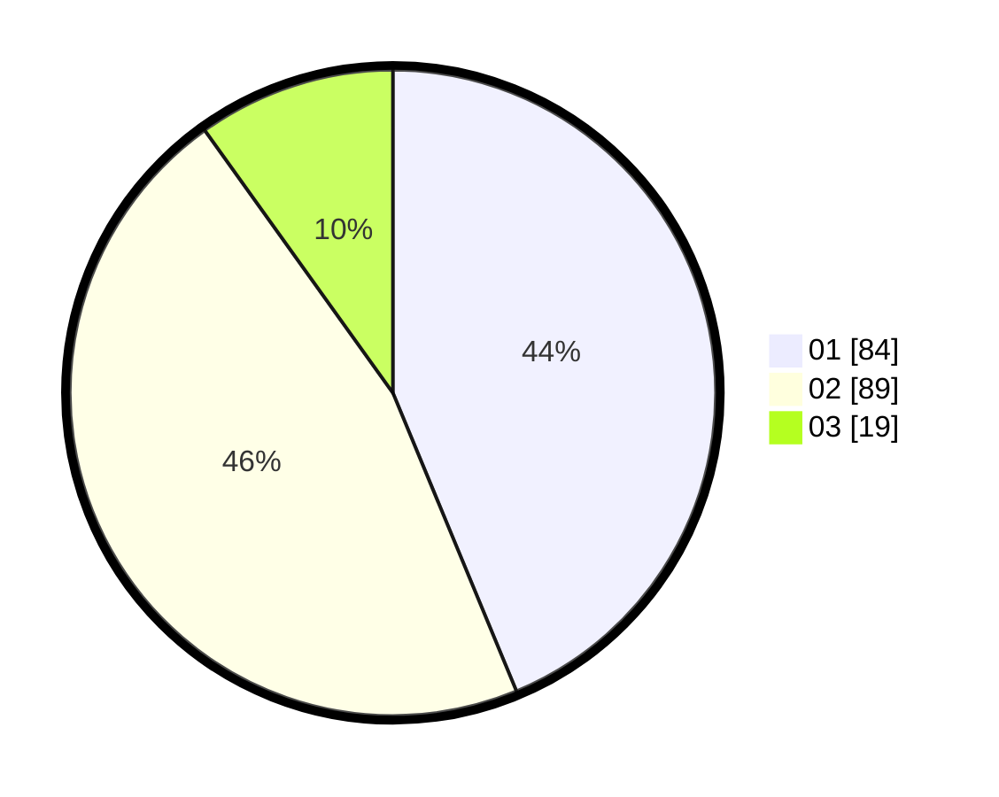

# Hasil

Hasil perolehan suara paslon dapat dilihat pada file paslon-01.txt, paslon-02.txt, dan paslon-03.txt.

Jika tidak ada, artinya data tersebut belum ada pada SIREKAP.

## Perolehan Suara

 * Paslon 01: **84**.
 * Paslon 02: **89**.
 * Paslon 03: **19**.

## Foto C Plano

https://sirekap-obj-formc.kpu.go.id/3ad4/pemilu/ppwp/31/74/04/10/01/3174041001014-20240214-155353--74a39486-f6f9-49ab-807a-d5b10869777d.jpg

https://sirekap-obj-formc.kpu.go.id/3ad4/pemilu/ppwp/31/74/04/10/01/3174041001014-20240214-155237--757faca1-63cf-4d55-b6d9-ed15b69f1d04.jpg

https://sirekap-obj-formc.kpu.go.id/3ad4/pemilu/ppwp/31/74/04/10/01/3174041001014-20240214-155425--aa8435c9-5231-4e58-8051-71d468689384.jpg

## DATA PEMILIH TETAP

Jumlah pemilih dalam DPT: **266**.
 * L: **136**.
 * P: **130**.

## DATA PENGGUNA HAK PILIH

Jumlah pengguna hak pilih dalam DPT: **189**.
 * L: **93**.
 * P: **96**.

Jumlah pengguna hak pilih dalam DPTb: **0**.
 * L: **0**.
 * P: **0**.

Jumlah pengguna hak pilih dalam DPK: **5**.
 * L: **3**.
 * P: **2**.

Jumlah pengguna hak pilih: **194**.
 * L: **96**.
 * P: **98**.

## JUMLAH SUARA SAH DAN TIDAK SAH

JUMLAH SELURUH SUARA SAH: **192**.

JUMLAH SUARA TIDAK SAH: **2**.

JUMLAH SELURUH SUARA SAH DAN SUARA TIDAK SAH: **194**.
